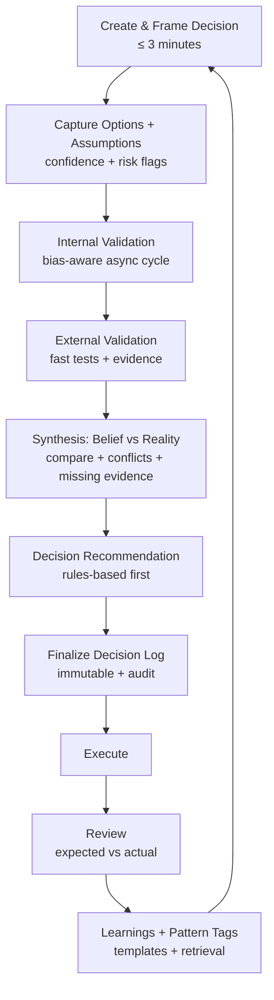
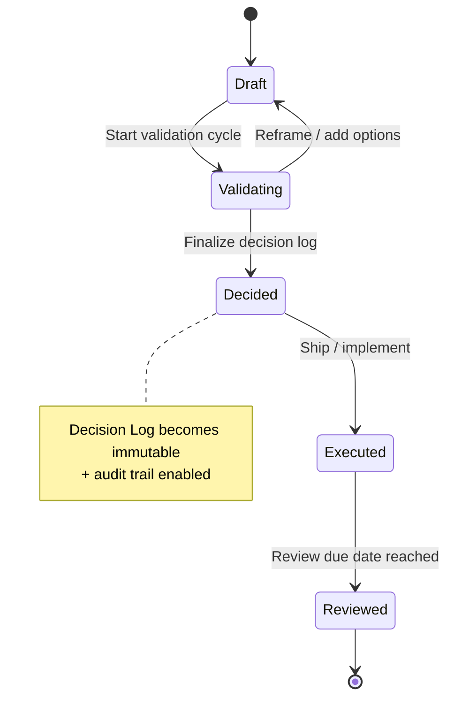
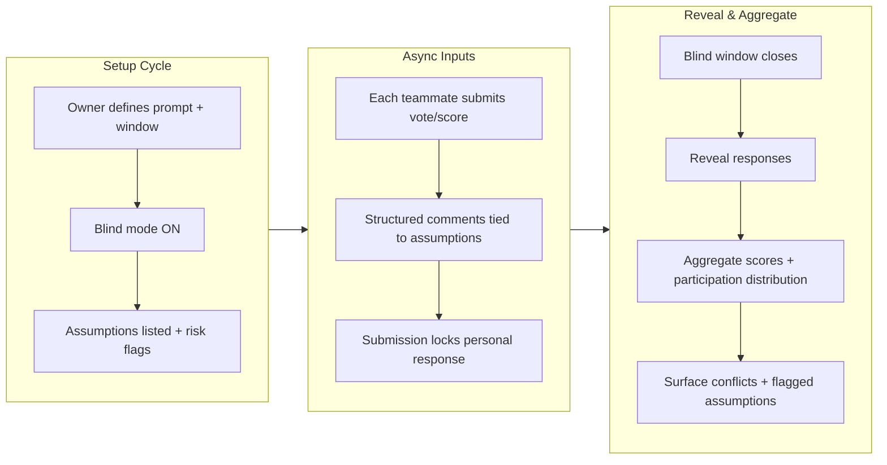
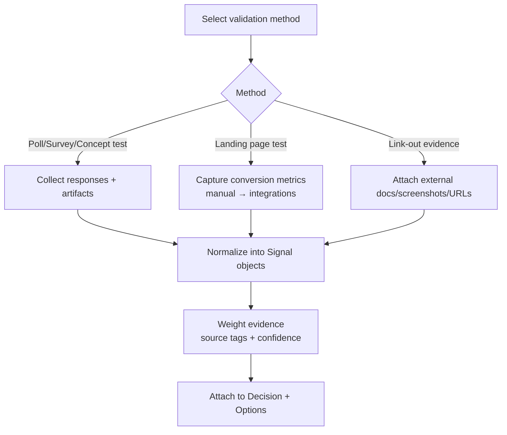
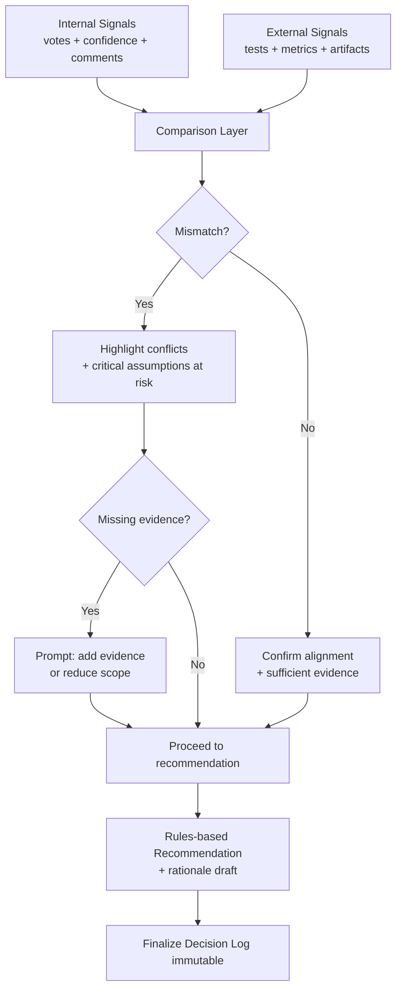
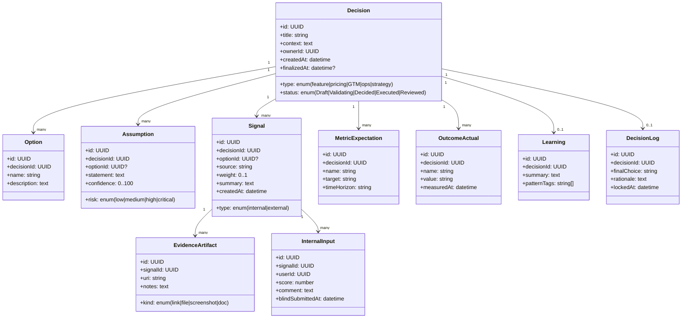
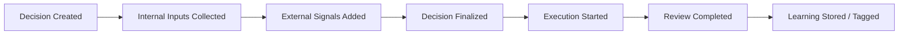

## 1) End-to-end workflow (Decision Validation loop)

## 2) Decision lifecycle (status state machine)

## 3) Bias-aware internal alignment (flow)

## 4) External validation (signal acquisition + aggregation)

## 5) Synthesis view (Belief vs Reality + recommendation path)

## 6) Core product objects (data model / class diagram)

## 7) Validation funnel (metric stages)

