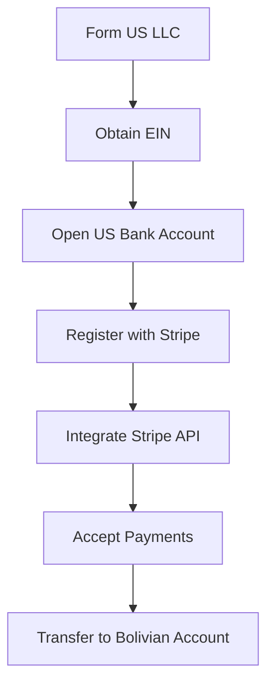
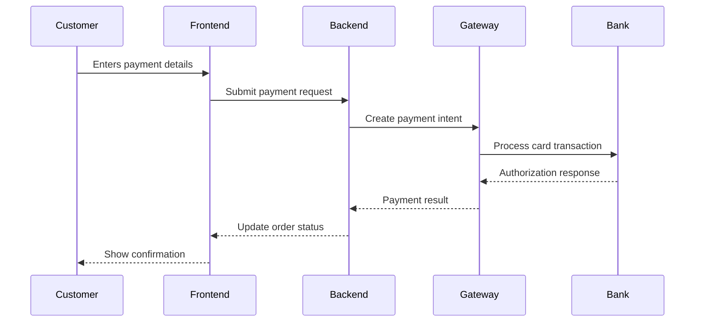
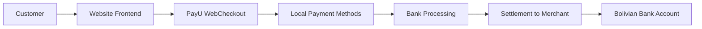
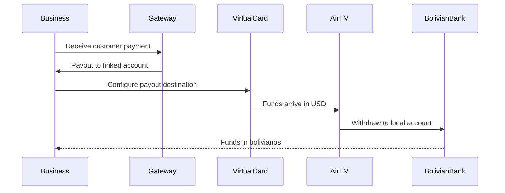

# Payment Gateway Integration Spike: Bolivia & International Solutions

## Index

1. [Summary](#executive-summary)
2. [International Payment Gateways](#international-payment-gateways)
   - [Stripe (via US LLC)](#1-stripe-via-us-llc)
   - [2Checkout (Verifone)](#2-2checkout-verifone)
   - [PayU Latam](#3-payu-latam)
3. [Bolivian Payment Solutions](#bolivian-payment-solutions)
   - [Mercado Pago](#1-mercado-pago)
   - [Virtual Cards (AirTM, Takenos, etc.)](#2-virtual-cards-airtm-takenos-etc)
4. [Comparison Table](#comparison-table)
5. [Integration Complexity](#integration-complexity)
6. [Discarded Solutions](#discarded-solutions)
7. [Recommendations](#recommendations)

## Summary

This document evaluates payment gateway options for Bolivian enterprises seeking to accept international payments. Our analysis focuses on solutions that minimize bureaucracy, require simple setup with basic configuration, and support either direct Bolivian bank accounts or virtual cards like AirTM and Takenos.

**Key Finding**: Bolivia is not directly supported by major international gateways like Stripe. However, viable paths exist through US company formation or by using regional alternatives like Mercado Pago and PayU Latam. Virtual card solutions from AirTM and Takenos provide practical workarounds for international payments.

## International Payment Gateways

### 1. Stripe (via US LLC)

<div align="center">
  
</div>

**Overview**: Stripe does not directly support Bolivia. To use Stripe from Bolivia, we must establish a US-based LLC and obtain the necessary US banking infrastructure.

**Requirements**:

- US Limited Liability Company (LLC) formation
- Employer Identification Number (EIN)
- US physical address (can use services like Shipito)
- US bank account (Payoneer, Wise, or similar)
- US phone number

**Setup Process**: The process involves incorporating a US business entity first, then applying for Stripe using those credentials. Services like IncorpUK or Doola can assist with this process, but it adds significant complexity and cost.

**Commission Structure**:

- Standard rate: 2.9% + $0.30 per transaction
- International cards: Additional 1% fee
- Currency conversion: 1% fee

**Advantages**:

- World-class developer experience with excellent documentation
- Comprehensive payment methods support (cards, wallets, ACH)
- Advanced fraud protection and security features
- Robust API with extensive React/JavaScript SDKs
- Strong dashboard and analytics tools

**Disadvantages**:

- Requires US company formation (significant upfront cost and complexity)
- Ongoing compliance and tax obligations in the US
- Not a simple "add credentials and go" solution
- Higher initial barrier to entry
- Requires maintaining US business entity

**Integration Difficulty**: High (due to prerequisites), but once established, the technical integration is straightforward.

**Bolivia Compatibility**: Not direct. Requires US LLC structure.

**Code Example**:

```javascript
// React integration with Stripe Elements
import { loadStripe } from "@stripe/stripe-js";
import {
  Elements,
  CardElement,
  useStripe,
  useElements,
} from "@stripe/react-stripe-js";

const stripePromise = loadStripe(process.env.REACT_APP_STRIPE_PUBLIC_KEY);

function CheckoutForm() {
  const stripe = useStripe();
  const elements = useElements();

  const handleSubmit = async (event) => {
    event.preventDefault();

    if (!stripe || !elements) {
      return;
    }

    const cardElement = elements.getElement(CardElement);

    const { error, paymentMethod } = await stripe.createPaymentMethod({
      type: "card",
      card: cardElement,
    });

    if (error) {
      console.error(error);
    } else {
      // Send paymentMethod.id to our server
      const response = await fetch("/api/process-payment", {
        method: "POST",
        headers: { "Content-Type": "application/json" },
        body: JSON.stringify({
          paymentMethodId: paymentMethod.id,
          amount: 5000, // amount in cents
        }),
      });

      const result = await response.json();
      console.log(result);
    }
  };

  return (
    <form onSubmit={handleSubmit}>
      <CardElement />
      <button type="submit" disabled={!stripe}>
        Pay
      </button>
    </form>
  );
}

export default function App() {
  return (
    <Elements stripe={stripePromise}>
      <CheckoutForm />
    </Elements>
  );
}
```

**Backend (Node.js)**:

```javascript
// Server-side payment processing
const stripe = require("stripe")(process.env.STRIPE_SECRET_KEY);

app.post("/api/process-payment", async (req, res) => {
  const { paymentMethodId, amount } = req.body;

  try {
    const paymentIntent = await stripe.paymentIntents.create({
      amount: amount,
      currency: "usd",
      payment_method: paymentMethodId,
      confirm: true,
      automatic_payment_methods: {
        enabled: true,
        allow_redirects: "never",
      },
    });

    res.json({
      success: true,
      paymentIntent: paymentIntent.id,
    });
  } catch (error) {
    res.status(400).json({
      error: error.message,
    });
  }
});
```

**Environment Variables**:

```env
STRIPE_PUBLIC_KEY=pk_live_xxxxxxxxxxxxx
STRIPE_SECRET_KEY=sk_live_xxxxxxxxxxxxx
```

#### Stripe via US LLC Flow

<div align="center">
  

</div>

### 2. 2Checkout (Verifone)

<div align="center">
  
</div>

**Overview**: 2Checkout is a global payment processor that explicitly supports Bolivia. It offers a straightforward integration process and accepts payments in over 200 countries.

**Requirements**:

- Business registration (can be Bolivian entity)
- Valid business email
- Bank account for payouts (Bolivian accounts accepted)
- Business verification documents
- Tax identification

**Setup Process**: We register on the 2Checkout platform, complete business verification, obtain API credentials from developer portal, and integrate. The platform offers both hosted payment pages and API integration.

**Commission Structure**:

- 2Sell plan: 3.5% + $0.35 per transaction
- 2Subscribe plan: 4.5% + $0.45 per transaction
- Additional 2% for cross-border payments in specific countries
- Currency conversion fees apply

**Advantages**:

- Direct Bolivia support without needing foreign company formation
- Multiple currency support including BOB
- Hosted checkout option reduces PCI compliance burden
- Subscription billing available
- Accept cards, PayPal, and local payment methods
- Reasonable pricing for international transactions

**Disadvantages**:

- Higher fees compared to Stripe
- User interface and dashboard less modern than competitors
- Documentation not as comprehensive as Stripe
- Fewer advanced features for complex payment flows
- Mixed reviews on customer support quality

**Integration Difficulty**: Medium. Straightforward API but less elegant than Stripe.

**Bolivia Compatibility**: Yes, directly supported.

**Code Example**:

```javascript
// React integration with 2Checkout
import { useEffect } from "react";

function CheckoutForm() {
  useEffect(() => {
    // Load 2Checkout.js
    const script = document.createElement("script");
    script.src = "https://www.2checkout.com/checkout/api/2co.min.js";
    script.async = true;
    document.body.appendChild(script);

    return () => {
      document.body.removeChild(script);
    };
  }, []);

  const handlePayment = () => {
    window.TCO.loadPubKey("sandbox", function () {
      const tokenRequest = {
        sellerId: process.env.REACT_APP_2CO_SELLER_ID,
        publishableKey: process.env.REACT_APP_2CO_PUBLIC_KEY,
        ccNo: document.getElementById("ccNo").value,
        cvv: document.getElementById("cvv").value,
        expMonth: document.getElementById("expMonth").value,
        expYear: document.getElementById("expYear").value,
      };

      window.TCO.requestToken(successCallback, errorCallback, tokenRequest);
    });
  };

  const successCallback = (data) => {
    // Send token to backend
    fetch("/api/process-2checkout", {
      method: "POST",
      headers: { "Content-Type": "application/json" },
      body: JSON.stringify({
        token: data.response.token.token,
        amount: 50.0,
        currency: "USD",
      }),
    })
      .then((response) => response.json())
      .then((result) => console.log(result));
  };

  const errorCallback = (error) => {
    console.error("2Checkout Error:", error);
  };

  return (
    <form>
      <input id="ccNo" type="text" placeholder="Card Number" />
      <input id="expMonth" type="text" placeholder="MM" />
      <input id="expYear" type="text" placeholder="YYYY" />
      <input id="cvv" type="text" placeholder="CVV" />
      <button type="button" onClick={handlePayment}>
        Pay with 2Checkout
      </button>
    </form>
  );
}

export default CheckoutForm;
```

**Backend Processing**:

```javascript
const axios = require("axios");

app.post("/api/process-2checkout", async (req, res) => {
  const { token, amount, currency } = req.body;

  const orderData = {
    sellerId: process.env.TWOCHECKOUT_SELLER_ID,
    privateKey: process.env.TWOCHECKOUT_PRIVATE_KEY,
    merchantOrderId: "ORDER-" + Date.now(),
    token: token,
    currency: currency,
    total: amount,
    billingAddr: {
      name: "Customer Name",
      addrLine1: "Address",
      city: "Cochabamba",
      state: "CB",
      zipCode: "0000",
      country: "BO",
      email: "customer@example.com",
      phoneNumber: "591-00000000",
    },
  };

  try {
    const response = await axios.post(
      "https://www.2checkout.com/checkout/api/1/sellerId/merchant/privateKey/order/create",
      orderData
    );

    res.json({ success: true, data: response.data });
  } catch (error) {
    res.status(400).json({ error: error.message });
  }
});
```

**Environment Variables**:

```env
REACT_APP_2CO_SELLER_ID=your_seller_id
REACT_APP_2CO_PUBLIC_KEY=your_public_key
TWOCHECKOUT_PRIVATE_KEY=your_private_key
```

#### Standard Payment Gateway Flow

<div align="center">



</div>

### 3. PayU Latam

<div align="center">
  
</div>

**Overview**: PayU Latam is a regional payment gateway with strong presence across Latin America, including Bolivia. It specializes in local payment methods and cross-border transactions within the region.

**Requirements**:

- Registered business entity
- Merchant account with PayU
- Business documentation and tax ID
- Bank account for settlements
- For some countries: Minimum monthly TPV of $100,000 USD

**Setup Process**: We apply for merchant account, provide business documentation, receive API credentials after approval, integrate using WebCheckout or API methods. Approval process can take several days to weeks.

**Commission Structure**:

- Varies by country and payment method
- Typically 3.49% - 4.99% + fixed fee per transaction
- Additional fees for specific payment methods like bank transfers
- Cross-border fees apply

**Advantages**:

- Strong regional presence in Latin America
- Supports local payment methods including QR codes
- Familiar with Bolivian market and regulations
- Multiple integration options (WebCheckout, API, SDK)
- Tokenization support for recurring payments
- Multi-currency support

**Disadvantages**:

- Complex onboarding process with documentation requirements
- Higher TPV requirements for some countries
- Less developer-friendly documentation than Stripe
- Integration can be more complex than modern alternatives
- Refund and dispute handling more manual
- Customer support primarily in Spanish

**Integration Difficulty**: Medium to High. Requires understanding of Latin American payment ecosystems.

**Bolivia Compatibility**: Yes, supported as part of Latin American coverage.

**Code Example**:

```javascript
// React PayU Latam Integration
import { useState } from "react";
import CryptoJS from "crypto-js";

function PayUCheckout() {
  const [formData, setFormData] = useState({
    referenceCode: "",
    amount: "",
    description: "",
  });

  const generateSignature = (referenceCode, amount) => {
    const apiKey = process.env.REACT_APP_PAYU_API_KEY;
    const merchantId = process.env.REACT_APP_PAYU_MERCHANT_ID;
    const currency = "USD";

    const signature = `${apiKey}~${merchantId}~${referenceCode}~${amount}~${currency}`;
    return CryptoJS.MD5(signature).toString();
  };

  const handleSubmit = (e) => {
    e.preventDefault();

    const signature = generateSignature(
      formData.referenceCode,
      formData.amount
    );

    const form = document.createElement("form");
    form.method = "POST";
    form.action = "https://checkout.payulatam.com/ppp-web-gateway-payu/";

    const fields = {
      merchantId: process.env.REACT_APP_PAYU_MERCHANT_ID,
      accountId: process.env.REACT_APP_PAYU_ACCOUNT_ID,
      description: formData.description,
      referenceCode: formData.referenceCode,
      amount: formData.amount,
      tax: "0",
      taxReturnBase: "0",
      currency: "USD",
      signature: signature,
      test: "0",
      buyerEmail: "buyer@example.com",
      responseUrl: "https://ourwebsite.com/response",
      confirmationUrl: "https://ourwebsite.com/confirmation",
    };

    Object.keys(fields).forEach((key) => {
      const input = document.createElement("input");
      input.type = "hidden";
      input.name = key;
      input.value = fields[key];
      form.appendChild(input);
    });

    document.body.appendChild(form);
    form.submit();
  };

  return (
    <form onSubmit={handleSubmit}>
      <input
        type="text"
        placeholder="Reference Code"
        value={formData.referenceCode}
        onChange={(e) =>
          setFormData({ ...formData, referenceCode: e.target.value })
        }
        required
      />
      <input
        type="number"
        placeholder="Amount"
        value={formData.amount}
        onChange={(e) => setFormData({ ...formData, amount: e.target.value })}
        required
      />
      <input
        type="text"
        placeholder="Description"
        value={formData.description}
        onChange={(e) =>
          setFormData({ ...formData, description: e.target.value })
        }
        required
      />
      <button type="submit">Pay with PayU</button>
    </form>
  );
}

export default PayUCheckout;
```

**API Integration (Node.js)**:

```javascript
const axios = require("axios");
const crypto = require("crypto");

app.post("/api/payu-payment", async (req, res) => {
  const { amount, description, email } = req.body;

  const referenceCode = "ORDER-" + Date.now();
  const merchantId = process.env.PAYU_MERCHANT_ID;
  const apiKey = process.env.PAYU_API_KEY;
  const apiLogin = process.env.PAYU_API_LOGIN;
  const accountId = process.env.PAYU_ACCOUNT_ID;

  const signature = crypto
    .createHash("md5")
    .update(`${apiKey}~${merchantId}~${referenceCode}~${amount}~USD`)
    .digest("hex");

  const paymentData = {
    language: "es",
    command: "SUBMIT_TRANSACTION",
    merchant: {
      apiKey: apiKey,
      apiLogin: apiLogin,
    },
    transaction: {
      order: {
        accountId: accountId,
        referenceCode: referenceCode,
        description: description,
        language: "es",
        signature: signature,
        notifyUrl: "https://ourwebsite.com/webhook",
        additionalValues: {
          TX_VALUE: {
            value: amount,
            currency: "USD",
          },
        },
        buyer: {
          merchantBuyerId: "1",
          fullName: "Customer Name",
          emailAddress: email,
          contactPhone: "591000000",
          dniNumber: "00000000",
          shippingAddress: {
            street1: "Address Line 1",
            city: "Cochabamba",
            state: "CB",
            country: "BO",
            postalCode: "0000",
            phone: "591000000",
          },
        },
      },
      type: "AUTHORIZATION_AND_CAPTURE",
      paymentMethod: "VISA",
      paymentCountry: "BO",
      ipAddress: "127.0.0.1",
    },
    test: false,
  };

  try {
    const response = await axios.post(
      "https://api.payulatam.com/payments-api/4.0/service.cgi",
      paymentData,
      {
        headers: {
          "Content-Type": "application/json",
          Accept: "application/json",
        },
      }
    );

    res.json({ success: true, data: response.data });
  } catch (error) {
    res.status(400).json({ error: error.message });
  }
});
```

**Environment Variables**:

```env
REACT_APP_PAYU_MERCHANT_ID=your_merchant_id
REACT_APP_PAYU_ACCOUNT_ID=your_account_id
REACT_APP_PAYU_API_KEY=your_api_key
PAYU_API_LOGIN=your_api_login
```

### PayU Latam Regional Integration

<div align="center">



</div>

## Bolivian Payment Solutions

### 1. Mercado Pago

<div align="center">
  
</div>

**Overview**: Mercado Pago is one of the most popular payment platforms in Latin America, operated by Mercado Libre. While its primary markets are Argentina, Brazil, Mexico, and Chile, it has limited presence in Bolivia through regional coverage.

**Requirements**:

- Mercado Pago/Mercado Libre account
- Business registration
- Tax identification
- Bank account for withdrawals
- Identity verification

**Setup Process**: We create account on Mercado Pago, complete verification, obtain API credentials from developer portal, integrate using Checkout Pro or API. The process is relatively streamlined for existing Mercado Libre users.

**Commission Structure**:

- Varies by country and payment method
- Typically 3.99% + fixed fee per transaction in supported markets
- QR code payments: Lower fees around 2.99%
- Bank transfers: Variable fees
- Cross-border transactions: Additional fees

**Advantages**:

- Well-known brand in Latin America
- Strong mobile app presence
- QR code payment support popular in Bolivia
- Good documentation in Spanish and Portuguese
- Multiple integration options (SDKs, API, Bricks)
- Subscription and recurring payment support
- Split payment capabilities

**Disadvantages**:

- Limited direct Bolivia support (more focused on Argentina, Brazil, Chile, Mexico)
- Commission rates can be high
- Requires existing Mercado Libre ecosystem presence
- Withdrawal to Bolivian banks may have limitations
- Some features restricted by country
- Primarily oriented toward C2C and marketplace transactions

**Integration Difficulty**: Medium. Good documentation but region-specific nuances.

**Bolivia Compatibility**: Limited. Better for businesses operating in multiple Latin American countries.

**Code Example**:

```javascript
// React Mercado Pago Integration using Checkout Pro
import { useEffect } from "react";

function MercadoPagoCheckout() {
  useEffect(() => {
    const script = document.createElement("script");
    script.src = "https://sdk.mercadopago.com/js/v2";
    script.async = true;
    document.body.appendChild(script);

    return () => {
      document.body.removeChild(script);
    };
  }, []);

  const createPreference = async () => {
    const response = await fetch("/api/create-preference", {
      method: "POST",
      headers: { "Content-Type": "application/json" },
      body: JSON.stringify({
        items: [
          {
            title: "Product Name",
            quantity: 1,
            unit_price: 100.0,
            currency_id: "USD",
          },
        ],
      }),
    });

    const data = await response.json();
    return data.preferenceId;
  };

  const handlePayment = async () => {
    const preferenceId = await createPreference();

    const mp = new window.MercadoPago(process.env.REACT_APP_MP_PUBLIC_KEY, {
      locale: "es-BO",
    });

    mp.checkout({
      preference: {
        id: preferenceId,
      },
      autoOpen: true,
    });
  };

  return <button onClick={handlePayment}>Pagar con Mercado Pago</button>;
}

export default MercadoPagoCheckout;
```

**Backend (Node.js) - Creating Preference**:

```javascript
const mercadopago = require("mercadopago");

mercadopago.configure({
  access_token: process.env.MP_ACCESS_TOKEN,
});

app.post("/api/create-preference", async (req, res) => {
  const { items } = req.body;

  const preference = {
    items: items,
    back_urls: {
      success: "https://ourwebsite.com/success",
      failure: "https://ourwebsite.com/failure",
      pending: "https://ourwebsite.com/pending",
    },
    auto_return: "approved",
    notification_url: "https://ourwebsite.com/webhook",
    statement_descriptor: "OUR_BUSINESS",
    external_reference: "ORDER-" + Date.now(),
    expires: true,
    expiration_date_from: new Date().toISOString(),
    expiration_date_to: new Date(
      Date.now() + 24 * 60 * 60 * 1000
    ).toISOString(),
  };

  try {
    const response = await mercadopago.preferences.create(preference);
    res.json({
      preferenceId: response.body.id,
      initPoint: response.body.init_point,
    });
  } catch (error) {
    res.status(400).json({ error: error.message });
  }
});

app.post("/webhook", async (req, res) => {
  const { type, data } = req.body;

  if (type === "payment") {
    const payment = await mercadopago.payment.findById(data.id);
    console.log("Payment status:", payment.body.status);
    // Process payment status
  }

  res.sendStatus(200);
});
```

**Environment Variables**:

```env
REACT_APP_MP_PUBLIC_KEY=APP_USR-xxxxxxxx-xxxx-xxxx-xxxx-xxxxxxxxxxxx
MP_ACCESS_TOKEN=APP_USR-xxxxxxxx-xxxx-xxxx-xxxx-xxxxxxxxxxxx
```

### 2. Virtual Cards (AirTM, Takenos, etc.)

<div align="center">
  
</div>

**Overview**: This is not a traditional payment gateway but rather a solution using US-issued virtual cards (Visa) from AirTM or Takenos that can be used with any payment processor that accepts international cards. This approach is increasingly popular in our country for receiving international payments.

**Requirements**:

- AirTM or Takenos account
- Identity verification (Bolivian ID accepted)
- Minimum balance to create virtual card:
  - AirTM: $5 USD for virtual card
  - Takenos: $5 USD for virtual card, $40 USD for physical card
- For payments: Integration with any gateway that accepts Visa/Mastercard

**Setup Process**: We create account, complete KYC verification, request virtual card, load balance, use card details with any international payment processor. The virtual cards can be used with Stripe, PayPal, and other services that normally wouldn't work directly in Bolivia.

**Commission Structure**:

AirTM:

- Card creation: $3.70 - $4.95 (varies by verification)
- Top-up fee: 3%
- Service fee: 1%
- Transaction fee: $1 fixed per transaction
- Monthly card limit: $1000 (unverified) or $2400 (verified)

Takenos:

- Virtual card: $5 USD one-time
- Physical card: $40 USD (promotional $20 USD for first 4000 cards)
- No monthly fees
- Deposit in bolivianos via QR code
- Exchange rate applied when depositing BOB to USD

**Advantages**:

- US-issued Visa cards work with most international services
- Can load from Bolivian bank accounts (Takenos via QR)
- Apple Pay and Google Pay compatible
- No need to form US company
- Immediate card availability
- Can receive payments from PayPal, Wise, Payoneer, freelance platforms
- Deposit in bolivianos and spend in dollars (Takenos)

**Disadvantages**:

- Not a payment gateway itself, just enables card payments
- Per-transaction fees can add up quickly (AirTM)
- Monthly spending limits
- Still need to integrate with actual payment gateway
- Exchange rate spread when converting currencies
- Limited customer support
- Virtual cards may be declined by some merchants

**Integration Difficulty**: Low for using the cards. Integration depends on chosen gateway.

**Bolivia Compatibility**: Excellent. Specifically designed for Latin American markets including Bolivia.

**Use Case Example**:

```javascript
// Using Takenos/AirTM cards with any payment gateway
// This example shows how to accept payments using these cards with Stripe

import { loadStripe } from "@stripe/stripe-js";
import {
  CardElement,
  Elements,
  useStripe,
  useElements,
} from "@stripe/react-stripe-js";

const stripePromise = loadStripe(process.env.REACT_APP_STRIPE_PUBLIC_KEY);

function VirtualCardPayment() {
  const stripe = useStripe();
  const elements = useElements();

  const handleSubmit = async (event) => {
    event.preventDefault();

    // Customer enters their AirTM or Takenos virtual card details
    const cardElement = elements.getElement(CardElement);

    const { error, paymentMethod } = await stripe.createPaymentMethod({
      type: "card",
      card: cardElement,
      billing_details: {
        name: "Customer Name",
        email: "customer@example.com",
      },
    });

    if (error) {
      console.error("Error:", error);
      return;
    }

    // Send to backend for processing
    const response = await fetch("/api/process-payment", {
      method: "POST",
      headers: { "Content-Type": "application/json" },
      body: JSON.stringify({
        paymentMethodId: paymentMethod.id,
        amount: 5000,
      }),
    });

    const result = await response.json();

    if (result.success) {
      console.log("Payment successful with virtual card!");
    }
  };

  return (
    <form onSubmit={handleSubmit}>
      <div className="info-box">
        <p>Customers can use their AirTM or Takenos virtual card</p>
        <ul>
          <li>US-issued Visa card accepted worldwide</li>
          <li>Enter 16-digit card number</li>
          <li>CVV and expiration date from app</li>
        </ul>
      </div>
      <CardElement
        options={{
          style: {
            base: {
              fontSize: "16px",
              color: "#424770",
              "::placeholder": {
                color: "#aab7c4",
              },
            },
          },
        }}
      />
      <button type="submit" disabled={!stripe}>
        Pay $50.00 USD
      </button>
    </form>
  );
}

export default function App() {
  return (
    <Elements stripe={stripePromise}>
      <VirtualCardPayment />
    </Elements>
  );
}
```

**Workflow for Bolivian Business**:

```javascript
// Example: Business receiving payments to AirTM/Takenos

// 1. Customer pays on our website using any gateway (Stripe, 2Checkout, etc.)
// 2. We configure our gateway payout to our AirTM US Virtual Account

// AirTM US Virtual Account setup
const airtmVirtualAccountInfo = {
  accountNumber: "OUR_AIRTM_ACCOUNT_NUMBER",
  routingNumber: "ROUTING_NUMBER",
  accountType: "checking",
  bankName: "Lead Bank",
};

// Configure payout in our payment gateway
// Example with Stripe Connect
const stripe = require("stripe")(process.env.STRIPE_SECRET_KEY);

async function createPayoutToAirTM(amount) {
  try {
    const payout = await stripe.payouts.create({
      amount: amount,
      currency: "usd",
      destination: "external_account_id", // Our linked AirTM account
      description: "Payout to AirTM virtual account",
    });

    console.log("Payout created:", payout.id);
    return payout;
  } catch (error) {
    console.error("Payout error:", error);
  }
}

// 3. Funds arrive in our AirTM account
// 4. We withdraw to Bolivian bank account via AirTM P2P network or ACH

// Takenos deposit example (QR code for bolivianos)
const takenosDepositFlow = {
  step1: "Open Takenos app",
  step2: 'Select "Deposit" > "Bolivianos (BOB)"',
  step3: "Enter amount in BOB",
  step4: "Generate QR code",
  step5: "Pay from Bolivian bank app",
  step6: "Funds converted to USD at current rate",
  note: "Exchange rate shown before confirmation",
};
```

### AirTM/Takenos Virtual Card Flow

<div align="center">



</div>

## Comparison Table

| Feature                        | Stripe (US LLC)  | 2Checkout           | PayU Latam             | Mercado Pago           | AirTM/Takenos + Stripe/2Checkout           |
| ------------------------------ | ---------------- | ------------------- | ---------------------- | ---------------------- | ------------------------------------------ |
| **Bolivia Support**            | No               | Yes                 | Yes                    | Limited                | Yes                                        |
| **Setup Complexity**           | Very High        | Medium              | Medium-High            | Medium                 | Medium                                     |
| **Transaction Fees**           | 2.9% + $0.30     | 3.5% + $0.35        | 3.49-4.99%             | 3.99% + fee            | 3-5% total                                 |
| **Technical Integration**      | Easy             | Medium              | Medium                 | Medium                 | Depends on gateway used (Stripe/2Checkout) |
| **Documentation Quality**      | Excellent        | Good                | Fair                   | Good                   | N/A (uses others)                          |
| **Time to First Payment**      | 4-8 weeks        | 1-2 weeks           | 2-4 weeks              | 1-2 weeks              | 1-3 days                                   |
| **Requires Company Formation** | Yes (US)         | No                  | No                     | No                     | No                                         |
| **Minimum Requirements**       | US LLC + Bank    | Business docs       | Business docs          | Account + verification | ID + $5 USD                                |
| **Recurring Payments**         | Excellent        | Good                | Good                   | Good                   | Manual                                     |
| **Developer Experience**       | Excellent        | Good                | Fair                   | Good                   | N/A                                        |
| **Local Currency Support**     | Limited          | Yes (BOB)           | Yes (BOB)              | Yes (BOB)              | USD only                                   |
| **Monthly Limits**             | None             | None                | None                   | Varies                 | $1000-$2400                                |
| **Best For**                   | Large operations | International sales | Regional Latin America | Marketplace/C2C        | Quick international access                 |

---

## Integration Complexity

### Code Complexity Rating

The following represents the relative complexity of implementing each solution:

**Stripe (US LLC)**: Once prerequisites are met, integration is straightforward. React SDK is mature and well-documented. Backend requires basic Node.js/Express knowledge. Complexity: 3/10 (technical only, excluding business setup).

**2Checkout**: Direct API integration with token-based payment processing. Requires understanding of PCI compliance and secure token handling. Documentation adequate but not as polished as Stripe. Complexity: 5/10.

**PayU Latam**: Regional nuances and Latin American payment methods add complexity. Signature generation and webhook handling require careful implementation. Spanish-language documentation may be barrier for some. Complexity: 6/10.

**Mercado Pago**: Similar complexity to PayU Latam but with better documentation. SDK available for common languages. Preference-based checkout simplifies some aspects. Complexity: 5/10.

**AirTM/Takenos**: Not really an integration since we're using standard card processing. Complexity depends entirely on chosen gateway. The cards themselves are simple to obtain and use. Complexity: 4/10 (for obtaining cards) + gateway complexity.

## Discarded Solutions

The following payment solutions were evaluated but ultimately discarded due to lack of Bolivia support or incompatibility with our requirements:

### PayPal

PayPal does not operate in Bolivia. As of 2024, Bolivia remains on PayPal's restricted countries list. Bolivian users cannot create PayPal accounts, and international PayPal users cannot send money to Bolivian recipients. This has been a long-standing restriction due to regulatory and compliance challenges in the Bolivian financial system.

**Reason for Exclusion**: No Bolivia support, explicitly restricted country.

### Wolipay

Wolipay contact support completely dissapeared from social media, and their website is broken. This payment gateway has been one of the most used bolivian payment gateways with native support for bolivian banks and QR payment options. However, it's disappearance is suspicious and demonstrates possible legal inconsistencies in their company.

**Reason for Exclusion**: Company dissappeared from social media and website broken. No way to contact the support team.

### Square

Square (now Block) primarily serves the US, Canada, UK, Australia, and Japan markets. While Square has international ambitions, it does not support Latin American countries including Bolivia. The platform requires a business address in one of their supported countries and a local bank account.

**Reason for Exclusion**: No Latin America support, no Bolivia compatibility.

### Adyen

While Adyen is a powerful global payment platform that technically supports Bolivia, it targets enterprise-level businesses with high transaction volumes. The platform requires significant monthly minimums, complex onboarding with extensive documentation, and is not suitable for small to medium businesses just starting with online payments.

**Reason for Exclusion**: Enterprise-only, high barriers to entry, overkill for typical Bolivian SMB needs.

### Authorize.Net

Authorize.Net requires a US-based business and US merchant account. While technically possible through US LLC formation similar to Stripe, Authorize.Net's legacy technology stack and dated API make it less attractive than Stripe for new integrations. The documentation and developer experience are significantly inferior to modern alternatives.

**Reason for Exclusion**: Requires US entity (same barrier as Stripe but worse developer experience), outdated technology.

### Braintree (PayPal)

Braintree, owned by PayPal, follows similar country restrictions as its parent company. Bolivia is not in their list of supported countries for merchant accounts. Even with a US LLC, the connection to PayPal infrastructure creates challenges for Bolivian businesses.

**Reason for Exclusion**: PayPal subsidiary with same Bolivia restrictions.

### Worldpay (FIS)

Worldpay Global Payments requires enterprise-level contracts and does not have straightforward support for Bolivian merchants. The platform is geared toward large retailers and multinational corporations rather than growing online businesses. Setup is complex and requires extensive documentation.

**Reason for Exclusion**: Enterprise-focused, no clear Bolivia support path, high barriers to entry.

### Coinbase Commerce (Cryptocurrency)

While cryptocurrency payments theoretically bypass traditional banking restrictions, Coinbase Commerce requires cryptocurrency adoption by customers. The volatility of cryptocurrencies, regulatory uncertainty in Bolivia regarding crypto, and limited customer adoption make this impractical for most businesses seeking reliable payment processing.

**Reason for Exclusion**: Cryptocurrency volatility, limited customer adoption, regulatory uncertainty.

---

## Recommendations

### For Quick Start with Minimal Bureaucracy

**Recommended Solution**: AirTM or Takenos Virtual Cards + Stripe or 2Checkout

This combination provides the fastest path to accepting international payments from Bolivia. We can obtain a virtual card within days and immediately use it with any major payment gateway. While we'll pay slightly higher fees due to the virtual card markup, we avoid the complexity of forming a US company or navigating complex regional payment regulations.

**Implementation Path**:

1. Create AirTM or Takenos account and complete verification (2-3 days)
2. Request virtual card and load initial balance ($5-10 minimum)
3. Use virtual card to set up Stripe account (as payment receiver)
4. Integrate Stripe into our React application
5. Configure payouts to our AirTM US virtual account number
6. Withdraw from AirTM to Bolivian bank account as needed

**Total Setup Time**: 1 week. **Total Cost to Start**: $5-10 USD. **Monthly Fees**: Transaction-based only.

### For Direct Bolivia Integration

**Recommended Solution**: 2Checkout (Verifone)

Among international gateways, 2Checkout offers the most straightforward path for Bolivian businesses without requiring US entity formation. While the fees are higher than Stripe, the direct Bolivia support and ability to use local business registration make it the pragmatic choice for businesses that want a proper merchant account.

**Implementation Path**:

1. Register business on 2Checkout platform
2. Submit verification documents (Bolivian business registration, tax ID)
3. Wait for approval (typically 1-2 weeks)
4. Obtain API credentials
5. Integrate using provided SDKs or direct API
6. Configure bank account for settlements

**Total Setup Time**: 2-3 weeks. **Requirements**: Registered business entity, tax documentation.

### For Regional Latin American Operations

**Recommended Solution**: PayU Latam

If our business operates across multiple Latin American countries or we want to offer local payment methods popular in the region (bank transfers, cash payments, QR codes), PayU Latam provides the most comprehensive regional solution. The higher complexity is offset by better local payment method support.

**Implementation Path**:

1. Apply for PayU merchant account
2. Provide business documentation for Bolivia
3. Integration using WebCheckout or API
4. Test with regional payment methods
5. Go live with multi-country support

**Total Setup Time**: 3-4 weeks. **Best For**: Businesses with regional ambitions beyond Bolivia.

## Final Considerations

### Tax Implications

We must remember that receiving international payments has tax implications in Bolivia. We should consult with a Bolivian accountant familiar with international commerce to understand our obligations regarding:

- Value Added Tax (IVA) on services
- Income tax on profits from international sales
- Foreign currency reporting requirements
- Potential withholding taxes

### Currency Considerations

Most international payment gateways settle in US Dollars. We should consider the following:

- Exchange rate risk when converting USD to BOB
- Timing of currency conversion (immediate vs. holding in USD)
- Bank fees for USD to BOB conversion
- Whether to price our products in USD or BOB for customers

### Testing and Development

All mentioned payment gateways offer sandbox/test environments. We should always test thoroughly before going live:

- Test successful payments
- Test failed payments and error handling
- Test webhook delivery and processing
- Test refund flows
- Test edge cases (expired cards, insufficient funds, etc.)

We use test card numbers provided by each gateway. We never use real card details in development environments.
