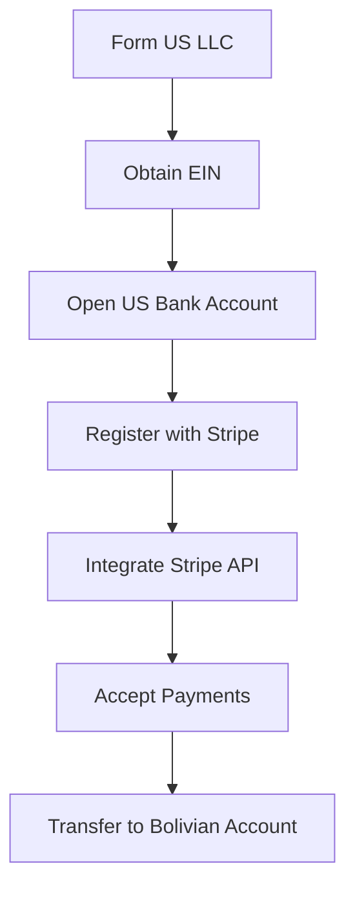
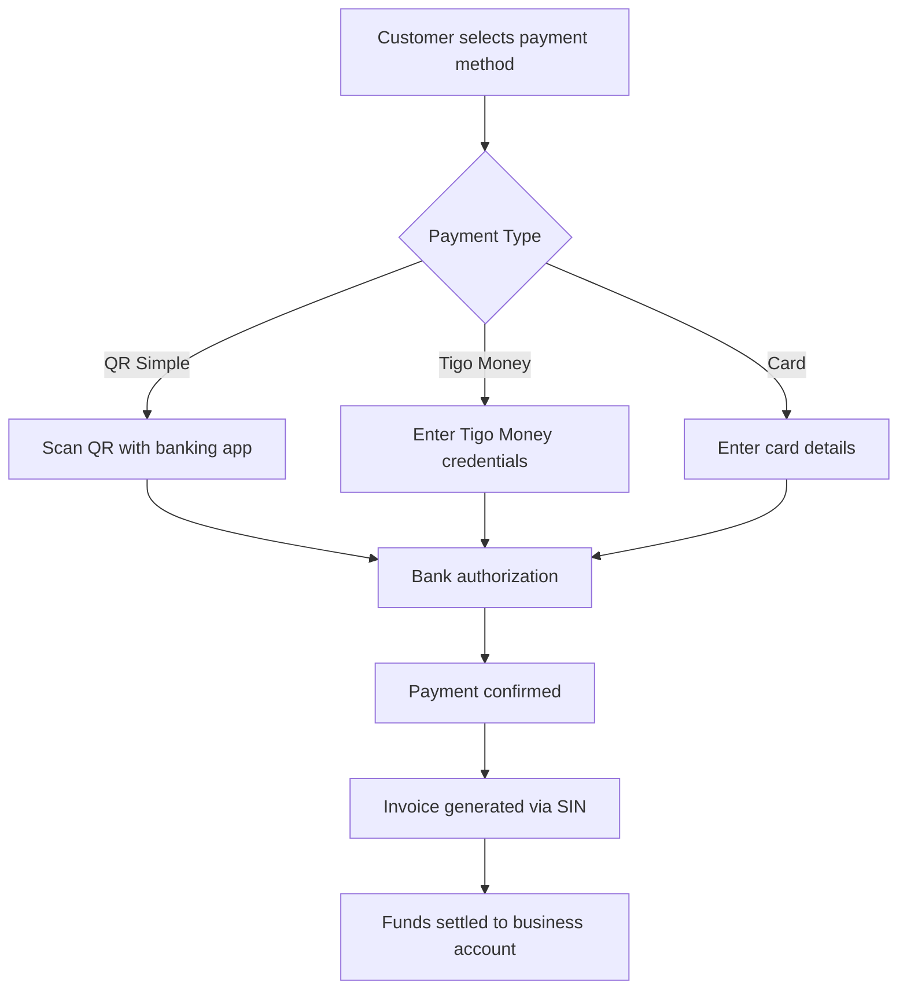
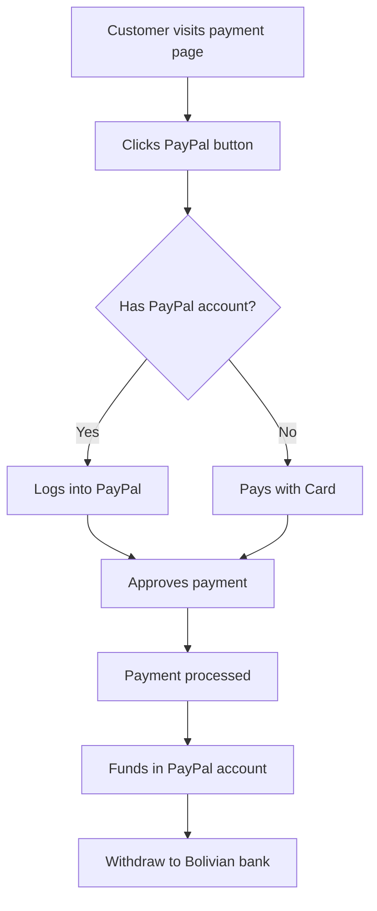
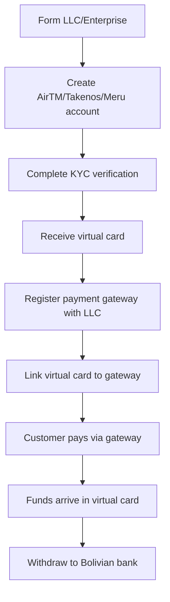
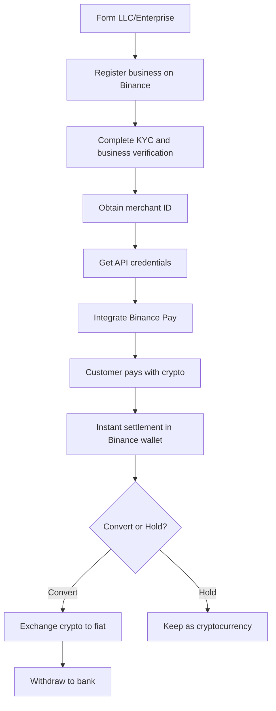
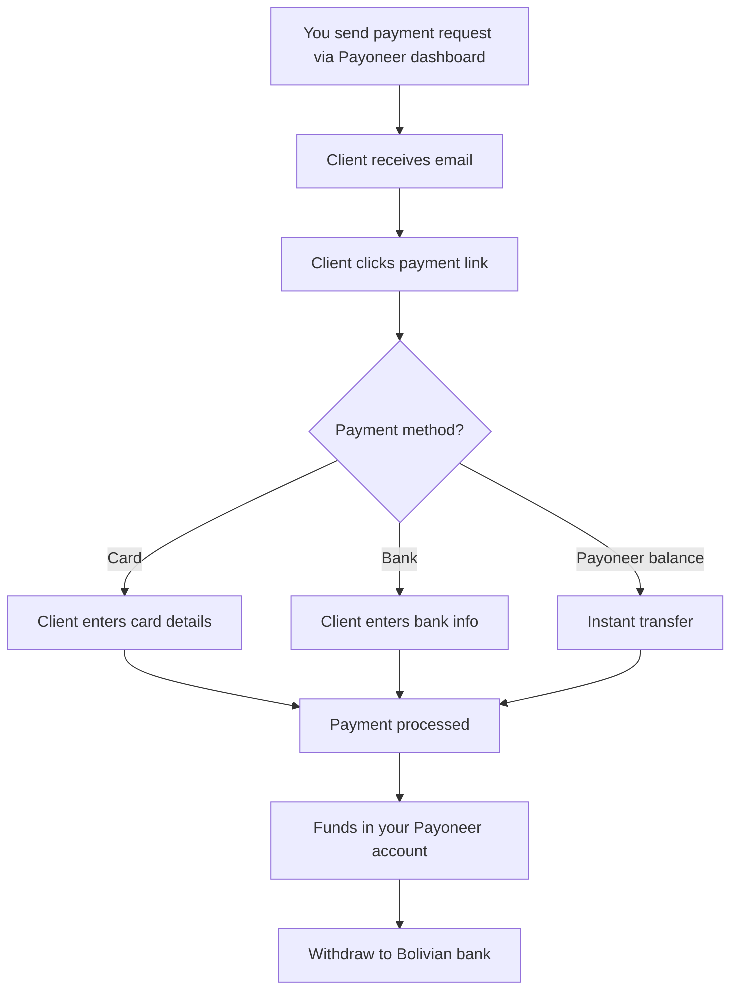

# Payment Gateway Integration Spike: Bolivia & International Solutions

## Index

1. [Summary](#executive-summary)
2. [International Payment Gateways](#international-payment-gateways)
   - [Stripe](#stripe)
   - [2Checkout (Verifone)](#2checkout-verifone)
   - [PayU Latam](#payu-latam)
   - [Mercado Pago](#mercado-pago)
3. [Bolivian Payment Solutions](#bolivian-payment-solutions)
   - [Libélula](#libélula)
4. [Digital Wallets](#digital-wallets)
   - [Google Pay](#google-pay)
   - [PayPal](#paypal)
   - [Virtual Cards (AirTM, Takenos, Meru)](#virtual-cards-airtm-takenos-meru)
5. [Cryptocurrency Payment Solutions](#cryptocurrency-payment-solutions)
   - [Binance Pay](#binance-pay)
6. [Global Payout Platforms](#global-payout-platforms)
   - [Payoneer](#payoneer)
7. [Merchant of Record (MoR) Platforms](#merchant-of-record-mor-platforms)
8. [Comparison Table](#comparison-table)
9. [Integration Complexity](#integration-complexity)
10. [Discarded Solutions](#discarded-solutions)
11. [Recommendations](#recommendations)

## Summary

This document evaluates payment gateway options for Bolivian enterprises seeking to accept international payments. Our analysis focuses on solutions that minimize bureaucracy, require simple setup with basic configuration, and support either direct Bolivian bank accounts or virtual cards like AirTM, Takenos, and Meru.

**Key Finding**: Bolivia is not directly supported by major international gateways like Stripe. However, viable paths exist through US company formation or by using regional alternatives like Libélula and PayU Latam. Virtual card solutions from AirTM, Takenos, and Meru provide practical workarounds for international payments. **Critical Discovery**: PayPal is the ONLY payment gateway that allows receiving payments without requiring enterprise formation (LLC, NIT, etc.) for small transactions. All other payment gateways - including Libélula, Stripe, 2Checkout, PayU Latam, and even Binance Pay - require mandatory enterprise formation with a merchant ID. This makes PayPal uniquely positioned for individual freelancers and small operations not yet ready to form a legal business entity. Mercado Pago does not support Bolivia and requires an Argentine phone number for registration.

## International Payment Gateways

### Stripe

<div align="center">
  
</div>

**Overview**: Stripe does not directly support Bolivia. To use Stripe from Bolivia, we must establish a US-based LLC and obtain the necessary US banking infrastructure. **Requires mandatory enterprise formation with merchant ID**.

**Requirements**:

- **US Limited Liability Company (LLC) formation** (mandatory)
- **Merchant ID / Business Tax ID**
- Employer Identification Number (EIN)
- US physical address (can use services like Shipito)
- US bank account (Payoneer, Wise, or similar)
- US phone number

**Setup Process**: The process involves incorporating a US business entity first, then applying for Stripe using those credentials. Services like IncorpUK or Doola can assist with this process, but it adds significant complexity and cost.

**Commission Structure**:

- Standard rate: 2.9% + $0.30 per transaction
- International cards: Additional 1% fee
- Currency conversion: 1% fee

**Advantages**:

- World-class developer experience with excellent documentation
- Comprehensive payment methods support (cards, wallets, ACH)
- Advanced fraud protection and security features
- Robust API with extensive React/JavaScript SDKs
- Strong dashboard and analytics tools

**Disadvantages**:

- **Requires US company formation** (significant upfront cost and complexity)
- **Requires merchant ID** - not available to individuals
- Ongoing compliance and tax obligations in the US
- Not a simple "add credentials and go" solution
- Higher initial barrier to entry
- Requires maintaining US business entity

**Integration Difficulty**: High (due to prerequisites), but once established, the technical integration is straightforward.

**Bolivia Compatibility**: Not direct. Requires US LLC structure.

**Code Example**:

```javascript
// React integration with Stripe Elements
import { loadStripe } from "@stripe/stripe-js";
import {
  Elements,
  CardElement,
  useStripe,
  useElements,
} from "@stripe/react-stripe-js";

const stripePromise = loadStripe(process.env.REACT_APP_STRIPE_PUBLIC_KEY);

function CheckoutForm() {
  const stripe = useStripe();
  const elements = useElements();

  const handleSubmit = async (event) => {
    event.preventDefault();

    if (!stripe || !elements) {
      return;
    }

    const cardElement = elements.getElement(CardElement);

    const { error, paymentMethod } = await stripe.createPaymentMethod({
      type: "card",
      card: cardElement,
    });

    if (error) {
      console.error(error);
    } else {
      // Send paymentMethod.id to our server
      const response = await fetch("/api/process-payment", {
        method: "POST",
        headers: { "Content-Type": "application/json" },
        body: JSON.stringify({
          paymentMethodId: paymentMethod.id,
          amount: 5000, // amount in cents
        }),
      });

      const result = await response.json();
      console.log(result);
    }
  };

  return (
    <form onSubmit={handleSubmit}>
      <CardElement />
      <button type="submit" disabled={!stripe}>
        Pay
      </button>
    </form>
  );
}

export default function App() {
  return (
    <Elements stripe={stripePromise}>
      <CheckoutForm />
    </Elements>
  );
}
```

**Backend (Node.js)**:

```javascript
// Server-side payment processing
const stripe = require("stripe")(process.env.STRIPE_SECRET_KEY);

app.post("/api/process-payment", async (req, res) => {
  const { paymentMethodId, amount } = req.body;

  try {
    const paymentIntent = await stripe.paymentIntents.create({
      amount: amount,
      currency: "usd",
      payment_method: paymentMethodId,
      confirm: true,
      automatic_payment_methods: {
        enabled: true,
        allow_redirects: "never",
      },
    });

    res.json({
      success: true,
      paymentIntent: paymentIntent.id,
    });
  } catch (error) {
    res.status(400).json({
      error: error.message,
    });
  }
});
```

**Environment Variables**:

```env
STRIPE_PUBLIC_KEY=pk_live_xxxxxxxxxxxxx
STRIPE_SECRET_KEY=sk_live_xxxxxxxxxxxxx
```

#### Stripe via US LLC Flow

<div align="center">
  


</div>

### 2Checkout (Verifone)

<div align="center">
  
</div>

**Overview**: 2Checkout (now part of Verifone) is one of the few international payment gateways that officially supports Bolivia. However, **it requires mandatory enterprise formation** with proper business documentation and merchant ID.

**Requirements**:

- **Registered business entity** (LLC, Corporation, or Bolivian enterprise with NIT) - mandatory
- **Merchant ID / Tax ID**
- Valid business documentation
- Business bank account
- Company website
- Tax identification number

**Commission Structure**:

- 3.5% + $0.35 per transaction (higher than Stripe)
- Additional fees for certain payment methods
- Currency conversion fees apply
- Monthly fee may apply depending on plan

**Advantages**:

- Direct Bolivia support (rare among international gateways)
- Accepts multiple payment methods (cards, PayPal, wire transfer)
- Global reach with 200+ countries
- Subscription and recurring billing support
- Fraud protection tools
- Multi-currency support

**Disadvantages**:

- **Requires business formation** - not available to individuals
- **Mandatory merchant ID**
- Higher fees than Stripe (3.5% vs 2.9%)
- Less developer-friendly than Stripe
- More complex onboarding process
- Rolling reserve requirements for some accounts
- Less comprehensive documentation

**Integration Difficulty**: Medium - requires business setup first, then technical integration.

**Bolivia Compatibility**: Direct support, but requires registered business entity.

**Code Example**:

```javascript
// 2Checkout.js integration example
<script src="https://www.2checkout.com/checkout/api/2co.min.js"></script>

<script>
// Initialize 2Checkout
TCO.loadPubKey('sandbox');

// Token request
TCO.requestToken(
  function(data) {
    // Success callback
    var token = data.response.token.token;
    // Send token to your server
    submitPayment(token);
  },
  function(error) {
    // Error callback
    console.error(error);
  },
  'ccForm' // Form ID
);
</script>

<form id="ccForm">
  <input type="text" id="ccNo" value="" placeholder="Card Number" data-2co="ccNo">
  <input type="text" id="cvv" value="" placeholder="CVV" data-2co="cvv">
  <input type="text" id="expMonth" value="" placeholder="MM" data-2co="expMonth">
  <input type="text" id="expYear" value="" placeholder="YYYY" data-2co="expYear">
  <button type="submit">Pay Now</button>
</form>
```

**Setup Process**:

1. Form required business entity (LLC or Bolivian enterprise)
2. Apply on 2Checkout website with business credentials
3. Submit verification documents (business registration, tax ID, bank statements)
4. Wait for approval (1-2 weeks)
5. Receive merchant account and API credentials
6. Integrate using provided SDKs
7. Complete test transactions
8. Go live after approval

**Current Status**: Viable but **requires enterprise formation**, making it unsuitable for individuals without a registered business.

### PayU Latam

<div align="center">
  
</div>

**Overview**: PayU Latam is a regional payment gateway that serves Latin America with localized payment methods. While it supports Bolivia, **it requires mandatory enterprise formation** with a registered business and merchant ID.

**Requirements**:

- **Registered business in Latin America** - mandatory
- **Merchant ID / Tax identification**
- Company documentation and registration
- Bank account in the name of the business
- Website with terms and conditions
- Legal representative documentation

**Regional Payment Methods**:

- Credit/Debit cards (Visa, Mastercard, American Express)
- Bank transfers (specific to each country)
- Cash payments at convenience stores
- QR code payments
- Local wallets

**Commission Structure** (varies by country):

- Bolivia: 4.0% + $0.30 per transaction (approximate)
- Varies by payment method
- Additional fees for certain local payment methods

**Advantages**:

- Regional focus with local payment method support
- Multi-country operations capability
- Localized checkout experience
- Spanish-language support and documentation
- Understanding of Latin American market
- Cash payment options popular in the region

**Disadvantages**:

- **Requires business registration** - not for individuals
- **Mandatory merchant ID and tax documentation**
- Higher fees than international gateways
- More complex setup for Bolivia specifically
- Limited documentation compared to Stripe
- Regional focus may limit global reach

**Integration Difficulty**: Medium to High - requires business formation and regional compliance understanding.

**Bolivia Compatibility**: Supported but requires registered Bolivian business entity.

**Code Example**:

```php
// PayU Latam PHP integration example
<?php
$apiKey = "YOUR_API_KEY";
$merchantId = "YOUR_MERCHANT_ID";
$accountId = "YOUR_ACCOUNT_ID";
$referenceCode = "ORDER_" . time();
$description = "Payment description";
$amount = "100.00";
$tax = "0";
$taxReturnBase = "0";
$currency = "USD";
$signature = md5($apiKey . "~" . $merchantId . "~" . $referenceCode . "~" . $amount . "~" . $currency);

$buyerEmail = "customer@example.com";
$responseUrl = "https://yoursite.com/response";
$confirmationUrl = "https://yoursite.com/confirmation";
?>

<form method="post" action="https://sandbox.checkout.payulatam.com/ppp-web-gateway-payu/">
  <input name="merchantId" type="hidden" value="<?php echo $merchantId; ?>">
  <input name="accountId" type="hidden" value="<?php echo $accountId; ?>">
  <input name="description" type="hidden" value="<?php echo $description; ?>">
  <input name="referenceCode" type="hidden" value="<?php echo $referenceCode; ?>">
  <input name="amount" type="hidden" value="<?php echo $amount; ?>">
  <input name="tax" type="hidden" value="<?php echo $tax; ?>">
  <input name="taxReturnBase" type="hidden" value="<?php echo $taxReturnBase; ?>">
  <input name="currency" type="hidden" value="<?php echo $currency; ?>">
  <input name="signature" type="hidden" value="<?php echo $signature; ?>">
  <input name="buyerEmail" type="hidden" value="<?php echo $buyerEmail; ?>">
  <input name="responseUrl" type="hidden" value="<?php echo $responseUrl; ?>">
  <input name="confirmationUrl" type="hidden" value="<?php echo $confirmationUrl; ?>">
  <input name="Submit" type="submit" value="Pay with PayU">
</form>
```

**Current Status**: **Requires enterprise formation** - not suitable for individuals or non-registered businesses.

### Mercado Pago

<div align="center">
  
</div>

**Overview**: Mercado Pago is Latin America's leading fintech payment solution, owned by MercadoLibre. However, it does not support Bolivia and requires an Argentine phone number for registration. Additionally, **it requires business registration** for merchant accounts.

**Bolivia Compatibility**: Not supported. Requires Argentine credentials.

**Current Status**: Not viable for our use case.

## Bolivian Payment Solutions

### Libélula

<div align="center">
  
</div>

**Overview**: Libélula is Bolivia's first and most established multichannel payment gateway with over 450 clients and 360K annual transactions per year. It's fully ASFI-compliant and offers the lowest fees in the market at 2.5%. However, **it requires mandatory enterprise formation** with Bolivian business registration and NIT.

**Requirements**:

- **Registered Bolivian enterprise with NIT** - mandatory
- **Business documentation and legal representative**
- Valid Bolivian tax identification
- Company bank account
- Business registration certificates

**Supported Payment Methods**:

- QR Simple (all major Bolivian banks)
- Tigo Money
- e-BISA
- VISA credit/debit cards (international)
- Mastercard (international)

**Commission Structure**:

- **2.5%** per transaction (lowest in Bolivia)
- No setup fees
- No monthly fees
- No hidden costs

**Advantages**:

- Lowest fees (2.5%) of any solution analyzed
- Full ASFI compliance
- Integrated SIN-certified invoicing
- Local support in Spanish with physical office in La Paz
- Native Bolivian payment methods (QR Simple, Tigo Money)
- International card support for global customers
- Ready-made plugins for popular e-commerce platforms
- Same-day settlement options
- Local currency (BOB) and USD support

**Disadvantages**:

- **Requires Bolivian enterprise formation** - mandatory NIT
- **Not available to individuals without business registration**
- Bolivia-focused (less international reach)
- Limited to Bolivian and some international payment methods
- Smaller developer community than international alternatives

**Integration Difficulty**: Low to Medium - simple for CMS plugins, medium for custom API integration. However, business formation adds complexity.

**Bolivia Compatibility**: Full native support, but requires registered business.

**Code Example**:

```php
// Libélula PHP Integration Example
<?php
$merchantId = "YOUR_MERCHANT_ID";
$secretKey = "YOUR_SECRET_KEY";
$amount = 100.00; // in BOB or USD
$orderId = "ORDER_" . time();
$currency = "BOB"; // or "USD"

// Generate signature
$signature = hash('sha256', $merchantId . $orderId . $amount . $currency . $secretKey);

// Payment request
$paymentData = [
    'merchantId' => $merchantId,
    'orderId' => $orderId,
    'amount' => $amount,
    'currency' => $currency,
    'signature' => $signature,
    'returnUrl' => 'https://yoursite.com/payment/return',
    'cancelUrl' => 'https://yoursite.com/payment/cancel',
    'notifyUrl' => 'https://yoursite.com/payment/notify',
    'description' => 'Product purchase'
];

// Redirect to Libélula payment page
header('Location: https://api.libelula.bo/payment?' . http_build_query($paymentData));
?>
```

**Setup Process**:

1. Form Bolivian enterprise and obtain NIT
2. Contact Libélula via https://libelula.bo
   - Documentation available at: [libelula-docs](../../uploads/libelula-docs/)
3. Complete registration with business documents
4. Submit legal representative documentation
5. Receive API credentials or install CMS plugin
6. Test in sandbox environment
7. Go live within 24 hours after approval

**Current Status**: Best option for Bolivian market, but **requires enterprise formation with NIT** - not available to individuals.

#### Libélula Payment Flow

<div align="center">



</div>

## Digital Wallets

### Google Pay

<div align="center">
  
</div>

**Overview**: Google Pay is a digital wallet that enables customers to make payments using saved payment methods. It works as a payment method layer on top of traditional payment gateways, not as a standalone payment processor.

**How It Works**:

Google Pay doesn't process payments directly - it stores the customer's payment methods (cards) and passes them to the underlying payment gateway (like Stripe, PayPal, or 2Checkout) for processing. This means:

1. Customer adds their card to Google Pay
2. Customer selects Google Pay at checkout
3. Google Pay passes the card token to your payment gateway
4. The payment gateway processes the transaction
5. Funds flow through your existing gateway setup

**Requirements**:

- An existing payment gateway integration (Stripe, PayPal, 2Checkout, etc.)
- HTTPS-enabled website
- Google Pay merchant account
- Integration with Google Pay API

**Commission Structure**:

- Google Pay itself is free
- You pay the fees of your underlying payment gateway
- Example: Using Google Pay with PayPal means you pay PayPal's 3.40-4.40% fees

**Advantages**:

- Faster checkout experience for customers
- Improved mobile conversion rates
- Secure tokenized payments
- Wide customer adoption
- Works across web and mobile
- One-click checkout

**Disadvantages**:

- Requires existing payment gateway
- Doesn't solve the "no business entity" problem
- Additional integration complexity
- Dependent on gateway capabilities

**Integration Difficulty**: Medium - requires both gateway and Google Pay integration.

**Code Example**:

```javascript
// Google Pay integration with PayPal backend
const baseRequest = {
  apiVersion: 2,
  apiVersionMinor: 0,
};

const tokenizationSpecification = {
  type: "PAYMENT_GATEWAY",
  parameters: {
    gateway: "paypal",
    gatewayMerchantId: "YOUR_PAYPAL_MERCHANT_ID",
  },
};

const cardPaymentMethod = {
  type: "CARD",
  parameters: {
    allowedAuthMethods: ["PAN_ONLY", "CRYPTOGRAM_3DS"],
    allowedCardNetworks: ["AMEX", "DISCOVER", "MASTERCARD", "VISA"],
  },
  tokenizationSpecification: tokenizationSpecification,
};

const paymentsClient = new google.payments.api.PaymentsClient({
  environment: "TEST", // or 'PRODUCTION'
});

function onGooglePayLoaded() {
  const isReadyToPayRequest = Object.assign({}, baseRequest);
  isReadyToPayRequest.allowedPaymentMethods = [cardPaymentMethod];

  paymentsClient
    .isReadyToPay(isReadyToPayRequest)
    .then(function (response) {
      if (response.result) {
        createGooglePayButton();
      }
    })
    .catch(function (err) {
      console.error(err);
    });
}

function createGooglePayButton() {
  const button = paymentsClient.createButton({
    onClick: onGooglePaymentButtonClicked,
  });
  document.getElementById("google-pay-button-container").appendChild(button);
}

function onGooglePaymentButtonClicked() {
  const paymentDataRequest = Object.assign({}, baseRequest);
  paymentDataRequest.allowedPaymentMethods = [cardPaymentMethod];
  paymentDataRequest.transactionInfo = {
    totalPriceStatus: "FINAL",
    totalPrice: "20.00",
    currencyCode: "USD",
  };
  paymentDataRequest.merchantInfo = {
    merchantName: "Your Store Name",
    merchantId: "YOUR_GOOGLE_MERCHANT_ID",
  };

  paymentsClient
    .loadPaymentData(paymentDataRequest)
    .then(function (paymentData) {
      // Process payment data
      processPayment(paymentData);
    })
    .catch(function (err) {
      console.error(err);
    });
}

function processPayment(paymentData) {
  // Send payment token to your server
  fetch("/api/process-google-pay", {
    method: "POST",
    headers: {
      "Content-Type": "application/json",
    },
    body: JSON.stringify(paymentData),
  })
    .then((response) => response.json())
    .then((data) => {
      console.log("Payment processed:", data);
    });
}
```

**Demo Project**:

A complete Google Pay integration example is available in the Chanchito Tools repository along with the PayPal integration:

**Repository**: https://github.com/ChanchitoFinance/ChanchitoTools/tree/main/ChanchitoTools.PaymentGateways

**Current Status**: Useful for improving user experience, but doesn't eliminate the need for a payment gateway or solve the business registration requirement.

### PayPal

<div align="center">
  
</div>

**Overview**: PayPal is a unique payment solution that works as both a digital wallet and a payment gateway. While PayPal is not officially present in Bolivia, it allows individuals to create accounts for receiving payments without requiring business registration or LLC formation. This makes PayPal the ONLY viable payment gateway for small transactions and individual freelancers who haven't formed a legal business entity yet.

**The PayPal Advantage - No Business Required**:

Unlike every other payment gateway analyzed in this document, PayPal allows you to receive payments as an individual without needing:

- LLC or business formation
- Merchant ID
- Tax ID number (NIT in Bolivia)
- Business registration documents

This is revolutionary for our use case, as we can start receiving payments immediately without the bureaucratic overhead of forming an enterprise.

**Requirements**:

- Email address
- Bank account or debit card for verification
- Phone number
- Valid identification

**How PayPal Works**:

PayPal functions as both:

1. **Digital Wallet**: Users can send money directly between PayPal accounts (PayPal-to-PayPal transfers)
2. **Payment Gateway**: Customers can pay using credit/debit cards (including virtual cards from AirTM, Takenos, Meru), and the payment is processed through PayPal's infrastructure

This dual functionality means our customers don't need PayPal accounts to pay us - they can use any card, making it more accessible than wallet-only solutions.

**Commission Structure for Bolivia (Receiving USD)**:

When someone from the [same region](https://www.paypal.com/bo/business/paypal-business-fees#statement-2) pays you:

- **3.40% + $0.30 USD** [fixed fee](https://www.paypal.com/bo/business/paypal-business-fees#comm-tran-fixed-fee-table) per transaction

When someone from another [international region](https://www.paypal.com/bo/business/paypal-business-fees#statement-2) pays you:

- **4.40% + $0.30 USD** [fixed fee](https://www.paypal.com/bo/business/paypal-business-fees#comm-tran-fixed-fee-table) per transaction

**Fee Examples for Our App**:

| Payment Amount | Same Region Fee | We Receive | International Fee | We Receive |
| -------------- | --------------- | ---------- | ----------------- | ---------- |
| $10.00         | $0.64           | $9.36      | $0.74             | $9.26      |
| $20.00         | $0.98           | $19.02     | $1.18             | $18.82     |
| $50.00         | $2.00           | $48.00     | $2.50             | $47.50     |
| $100.00        | $3.70           | $96.30     | $4.70             | $95.30     |

**Important Considerations for Bolivia**:

While PayPal is not officially present in Bolivia, you can create an account for receiving payments only. To avoid account restrictions or bans:

1. Use your real, accurate personal information
2. Only receive payments - avoid sending money frequently
3. Don't use VPNs or proxies that might trigger fraud detection
4. Withdraw funds to your bank account regularly
5. Keep transaction volumes reasonable initially
6. Be prepared to provide documentation if requested

**Setup Process**:

1. Create a PayPal account at https://www.paypal.com
2. Verify your email address
3. Link a bank account or debit card
4. Verify your identity with documentation
5. Create payment buttons or use API integration
6. Start receiving payments immediately

**PayPal Developer Integration**:

PayPal provides snippet codes for easy integration. They offer both sandbox accounts (for testing) and production accounts. Here's an example of a subscription button integration:

**Code Example**:

```html
<div id="paypal-button-container-P-7XL6174779208154NNFMVCSQ"></div>

<script
  src="https://www.paypal.com/sdk/js?client-id=AbpReajB3MTZYC812uRjoTBhTpaA5VAfH6iYeRC0xa6FMWg0TT6umECzeLNJQgqDSREhs52zx_TRObMh&vault=true&intent=subscription"
  data-sdk-integration-source="button-factory"
></script>

<script>
  paypal
    .Buttons({
      style: {
        shape: "rect",
        color: "black",
        layout: "vertical",
        label: "subscribe",
      },
      createSubscription: function (data, actions) {
        return actions.subscription.create({
          /* Creates the subscription */
          plan_id: "P-7XL6174779208154NNFMVCSQ",
        });
      },
      onApprove: function (data, actions) {
        alert(data.subscriptionID); // You can add optional success message for the subscriber here
      },
    })
    .render("#paypal-button-container-P-7XL6174779208154NNFMVCSQ"); // Renders the PayPal button
</script>
```

**One-time Payment Button Example**:

```html
<div id="paypal-button-container"></div>

<script src="https://www.paypal.com/sdk/js?client-id=YOUR_CLIENT_ID&currency=USD"></script>

<script>
  paypal
    .Buttons({
      createOrder: function (data, actions) {
        return actions.order.create({
          purchase_units: [
            {
              amount: {
                value: "20.00", // Payment amount
              },
            },
          ],
        });
      },
      onApprove: function (data, actions) {
        return actions.order.capture().then(function (details) {
          alert("Transaction completed by " + details.payer.name.given_name);
          // Call your server to save the transaction
          return fetch("/api/paypal-transaction-complete", {
            method: "post",
            headers: {
              "content-type": "application/json",
            },
            body: JSON.stringify({
              orderID: data.orderID,
            }),
          });
        });
      },
    })
    .render("#paypal-button-container");
</script>
```

**Testing Environment**:

PayPal provides:

- **Sandbox accounts**: Test customer and vendor accounts for development
- **Test credentials**: For integration testing without real money
- **Button generator**: Visual tool to create payment buttons with custom styling

**Demo Project**:

A complete PayPal integration demo can be found in the Chanchito Tools repository along with the Google Pay example:

**Repository**: https://github.com/ChanchitoFinance/ChanchitoTools/tree/main/ChanchitoTools.PaymentGateways

**Advantages**:

- **No business formation required** - the single biggest advantage
- Accepts both PayPal-to-PayPal and card payments
- Works with virtual cards (AirTM, Takenos, Meru)
- Easy integration with snippet codes provided
- Sandbox environment for testing
- Buyer and seller protection programs
- Mobile-friendly payment interface
- Widely recognized and trusted by customers globally
- Instant payment notifications via webhooks
- Support for subscriptions and recurring payments

**Disadvantages**:

- Not officially supported in Bolivia (requires careful account management)
- Higher fees than Stripe (3.40-4.40% vs 2.9%)
- Risk of account limitations if PayPal detects irregular activity
- Must withdraw funds regularly to avoid holds
- Limited customer support for unofficial countries
- Currency conversion fees when withdrawing to Bolivian banks
- Account can be frozen pending verification

**Integration Difficulty**: Low - PayPal provides ready-to-use button code and comprehensive documentation.

**Bolivia Compatibility**: Unofficial but functional. Requires careful account management to avoid restrictions.

**Why We Previously Discarded PayPal**:

We initially thought PayPal was not a viable solution because it's not officially present in Bolivia. However, after further research, we discovered that it's actually possible to create a PayPal account for receiving payments only, as long as you're careful about account management and follow their terms of service. The key insight is that while PayPal doesn't officially serve Bolivia, they don't explicitly prohibit Bolivian residents from receiving payments.

**Current Status**: **Now our PRIMARY recommendation** for individuals and small operations without an LLC or business registration.

#### PayPal Payment Flow

<div align="center">
  


</div>

### Virtual Cards (AirTM, Takenos, Meru)

<div align="center">
  
</div>

**Overview**: AirTM, Takenos, and Meru are digital wallet platforms that provide US-based virtual debit cards. These platforms use stablecoins (USDC/USDT) as their infrastructure layer, but they don't manage crypto as a product - this is what differentiates them from crypto-specific platforms like Binance. The virtual cards they issue can be used with traditional payment gateways that require US bank accounts or cards.

**How They Work**:

1. You create an account on AirTM, Takenos, or Meru
2. You receive a US-based virtual debit card (Visa/Mastercard)
3. You fund your account with cryptocurrency (USDC/USDT) or bank transfer
4. The platform converts your crypto to USD in the card
5. You use this virtual card with payment gateways like Stripe or 2Checkout
6. Payments you receive are deposited to your virtual card
7. You can withdraw funds to your Bolivian bank account

**Cryptocurrency as Infrastructure, Not Product**:

These platforms use USDC and USDT stablecoins as the technological infrastructure to move money efficiently across borders, but they present themselves as digital dollar accounts rather than crypto wallets. This means:

- You don't need to understand cryptocurrency
- The interface shows dollars, not crypto
- Transactions feel like normal banking
- Crypto volatility is eliminated (stablecoins are pegged to USD)
- The crypto layer is hidden from the user experience

This infrastructure approach differs fundamentally from Binance, where cryptocurrency is the product itself and users actively trade, invest, and manage crypto assets.

**Requirements**:

- Valid identification document
- Proof of address
- Email and phone number
- KYC verification (typically takes 2-3 days)

**Fees**:

- **AirTM**:

  - Virtual card issuance: $5-10 USD
  - Monthly maintenance: $2-5 USD
  - Withdrawal to Bolivian bank: ~3-5%
  - Minimal API for receiving AirTM-to-AirTM payments

- **Takenos**:

  - Virtual card issuance: $5 USD
  - Monthly maintenance: $3 USD
  - Withdrawal fees: 2-4%

- **Meru**:
  - Virtual card issuance: $5 USD
  - Monthly maintenance: Variable
  - Withdrawal fees: Similar to AirTM and Takenos

**Usage with Payment Gateways**:

These virtual cards work with payment gateways that accept US bank accounts or cards. However, **you still need to register the payment gateway with a business entity (LLC)**:

1. Form LLC (US or other jurisdiction)
2. Create AirTM/Takenos/Meru account
3. Register payment gateway using LLC credentials
4. Link virtual card as payout method
5. Receive payments to virtual card
6. Withdraw to Bolivian bank when needed

**Advantages**:

- Bridges Bolivia to international payment systems
- Works with gateways requiring US bank accounts
- Cryptocurrency infrastructure provides fast, cheap international transfers
- Lower withdrawal fees than traditional banking
- Can hold funds in USD (useful for currency stability)
- Multiple card options available
- Relatively quick KYC process
- AirTM offers minimal API for direct AirTM-to-AirTM payments

**Disadvantages**:

- **Still requires LLC or business registration** for payment gateway use
- Monthly maintenance fees
- Withdrawal fees to Bolivian banks
- Dependent on cryptocurrency infrastructure stability
- Risk of account freezes if unusual activity detected
- Must fund initially with crypto or international transfer
- Virtual cards may be rejected by some merchants
- Not a standalone payment solution

**Integration Difficulty**: Low for obtaining the card, but High overall due to required business formation for gateway integration.

**Bolivia Compatibility**: Works as a banking layer, but the underlying payment gateways still require business formation.

**Code Example** (AirTM minimal API):

```javascript
// AirTM minimal API for receiving AirTM-to-AirTM payments
// Note: This only works for AirTM user to AirTM user payments
// Not a full payment gateway solution

const airtmConfig = {
  apiKey: "YOUR_AIRTM_API_KEY",
  accountEmail: "your@email.com",
};

async function createAirTMPaymentRequest(amount, description) {
  const response = await fetch("https://api.airtm.com/v1/payment-requests", {
    method: "POST",
    headers: {
      Authorization: `Bearer ${airtmConfig.apiKey}`,
      "Content-Type": "application/json",
    },
    body: JSON.stringify({
      amount: amount,
      currency: "USD",
      description: description,
      recipient: airtmConfig.accountEmail,
    }),
  });

  const data = await response.json();
  return data.paymentUrl; // Share this URL with the payer
}

// Usage
const paymentUrl = await createAirTMPaymentRequest(20.0, "Service payment");
console.log("Send this link to your customer:", paymentUrl);
```

**Current Status**: Useful workaround but **requires business formation** for full payment gateway integration. AirTM's direct API is limited to AirTM-to-AirTM transfers only.

#### Virtual Card Payment Flow

<div align="center">



</div>

## Cryptocurrency Payment Solutions

### Binance Pay

<div align="center">
  
</div>

**Overview**: Binance Pay is a cryptocurrency payment solution from Binance, the world's largest cryptocurrency exchange. Unlike AirTM, Takenos, and Meru (which use crypto as infrastructure), Binance manages cryptocurrency as a product. Users actively hold, trade, and transact in various cryptocurrencies.

**How Binance Pay Works**:

Binance Pay allows businesses to accept cryptocurrency payments directly:

1. Customer has cryptocurrency in their Binance wallet
2. Merchant displays Binance Pay QR code or payment link
3. Customer scans QR or clicks link
4. Payment is made in cryptocurrency (USDT, USDC, BTC, ETH, BNB, etc.)
5. Merchant receives crypto in their Binance account
6. Merchant can convert to fiat or keep as crypto

**Merchant Requirements**:

**Critical Requirement**: **Binance Pay requires a merchant ID, which means you need an LLC or registered business entity**. This is the same requirement as traditional payment gateways.

- **Registered business entity (LLC or equivalent)** - mandatory
- **Business documentation and tax ID**
- Binance account with KYC verification
- Business verification on Binance
- Merchant API credentials

**Commission Structure**:

- **0% transaction fees** for Binance Pay transactions
- However, cryptocurrency conversion fees apply if converting to fiat
- Withdrawal fees to banks (varies by method and amount)
- Potential network fees for blockchain transactions

**Supported Cryptocurrencies**:

- USDT (Tether - stablecoin)
- USDC (USD Coin - stablecoin)
- BUSD (Binance USD - stablecoin)
- BTC (Bitcoin)
- ETH (Ethereum)
- BNB (Binance Coin)
- And 100+ other cryptocurrencies

**Advantages**:

- Zero transaction fees for Binance Pay
- Instant settlement (seconds)
- Global reach without banking intermediaries
- Multiple cryptocurrency options
- Can hold funds in crypto (potential appreciation)
- No chargebacks (blockchain transactions are final)
- Lower fees than traditional payment gateways (0% vs 2.5-4.5%)

**Disadvantages**:

- **Requires business registration and merchant ID** - not for individuals
- Customer must have cryptocurrency and Binance account
- Limited customer adoption (not everyone has crypto)
- Cryptocurrency volatility risk (unless using stablecoins)
- Regulatory uncertainty in Bolivia regarding crypto
- Complex for non-crypto-savvy customers
- Converting crypto to fiat adds fees
- Blockchain network fees can be high during congestion
- No buyer protection like traditional payment methods

**Integration Difficulty**: Medium - requires understanding of cryptocurrency and Binance ecosystem, plus business formation.

**Bolivia Compatibility**: Technically works, but requires business registration. Regulatory status of cryptocurrency in Bolivia is uncertain.

**Code Example**:

```javascript
// Binance Pay API Integration Example
const axios = require("axios");
const crypto = require("crypto");

const binanceConfig = {
  apiKey: "YOUR_API_KEY",
  secretKey: "YOUR_SECRET_KEY",
  merchantId: "YOUR_MERCHANT_ID", // Requires business registration
};

// Generate signature for Binance API
function generateSignature(timestamp, nonce, body) {
  const payload = timestamp + "\n" + nonce + "\n" + body + "\n";
  return crypto
    .createHmac("sha512", binanceConfig.secretKey)
    .update(payload)
    .digest("hex")
    .toUpperCase();
}

// Create Binance Pay order
async function createBinancePayOrder(amount, currency, orderDescription) {
  const timestamp = Date.now();
  const nonce = crypto.randomBytes(16).toString("hex");

  const requestBody = {
    env: {
      terminalType: "WEB",
    },
    merchantTradeNo: `ORDER_${timestamp}`,
    orderAmount: amount,
    currency: currency, // e.g., 'USDT', 'USDC', 'USD'
    goods: {
      goodsType: "01", // Virtual goods
      goodsCategory: "Z000", // Others
      referenceGoodsId: "PRODUCT_001",
      goodsName: orderDescription,
    },
  };

  const body = JSON.stringify(requestBody);
  const signature = generateSignature(timestamp, nonce, body);

  try {
    const response = await axios.post(
      "https://bpay.binanceapi.com/binancepay/openapi/v2/order",
      requestBody,
      {
        headers: {
          "Content-Type": "application/json",
          "BinancePay-Timestamp": timestamp,
          "BinancePay-Nonce": nonce,
          "BinancePay-Certificate-SN": binanceConfig.apiKey,
          "BinancePay-Signature": signature,
        },
      }
    );

    return response.data;
  } catch (error) {
    console.error("Binance Pay Error:", error.response.data);
    throw error;
  }
}

// Usage example
async function processPayment() {
  try {
    const order = await createBinancePayOrder(
      20.0,
      "USDT", // Stable coin to avoid volatility
      "Premium subscription"
    );

    console.log("Payment URL:", order.data.universalUrl);
    console.log("QR Code:", order.data.qrcodeLink);

    // Show QR code to customer or redirect to payment URL
    return order;
  } catch (error) {
    console.error("Payment creation failed:", error);
  }
}
```

**Webhook Integration** (for payment confirmation):

```javascript
// Express.js webhook handler
const express = require("express");
const app = express();

app.post("/webhooks/binance-pay", express.json(), (req, res) => {
  const webhookData = req.body;

  // Verify webhook signature
  const receivedSignature = req.headers["binancepay-signature"];
  const timestamp = req.headers["binancepay-timestamp"];
  const nonce = req.headers["binancepay-nonce"];

  const expectedSignature = generateSignature(
    timestamp,
    nonce,
    JSON.stringify(webhookData)
  );

  if (receivedSignature !== expectedSignature) {
    return res.status(401).json({ error: "Invalid signature" });
  }

  // Process payment confirmation
  if (webhookData.bizStatus === "PAY_SUCCESS") {
    const merchantTradeNo = webhookData.data.merchantTradeNo;
    const totalFee = webhookData.data.totalFee;
    const currency = webhookData.data.currency;

    console.log(
      `Payment received: ${totalFee} ${currency} for order ${merchantTradeNo}`
    );

    // Update your database, fulfill order, etc.
    fulfillOrder(merchantTradeNo);
  }

  res.json({ returnCode: "SUCCESS" });
});
```

**Current Status**: **Requires business registration with merchant ID** - not available to individuals. While crypto payments offer advantages like zero fees and instant settlement, the business registration requirement makes it equivalent to traditional gateways in terms of barriers to entry. Additionally, low customer adoption of cryptocurrency payments limits practical viability.

#### Binance Pay Flow

<div align="center">



</div>

## Global Payout Platforms

**Overview**: Global payout platforms are financial technology services designed primarily for receiving payments from clients, marketplaces, and platforms worldwide. Unlike traditional payment gateways that focus on merchant-initiated transactions, payout platforms specialize in getting paid by others and managing those funds across borders.

### Payoneer

<div align="center">
  
</div>

**Overview**: Payoneer is a global payment platform founded in 2005 that serves over 5 million users across 190+ countries. While often compared to payment gateways, Payoneer's core strength is as a payout and receiving platform, particularly for freelancers, online sellers, and businesses receiving payments from international clients and marketplaces.

**How Payoneer Works**:

Payoneer operates differently from traditional payment gateways like Stripe or PayPal:

1. **Primary Use - Receiving Payments**: Payoneer excels at receiving funds from:

   - Marketplaces (Amazon, eBay, Airbnb, Fiverr, Upwork, etc.)
   - International clients via payment requests
   - Other Payoneer users (Payoneer-to-Payoneer transfers)
   - Business partners and customers

2. **Global Receiving Accounts**: Payoneer provides you with local bank account details in major currencies (USD, EUR, GBP, JPY, etc.), allowing you to receive payments as if you had a local bank account in those countries

3. **Payment Request Feature**: You can send payment requests to clients who can pay via:

   - Credit/debit card
   - ACH bank debit (US)
   - Direct bank payment (UK)
   - Bank transfer

4. **Limited Payment Gateway Capabilities**: Payoneer does offer a Checkout API, but it requires special partnership agreements and is primarily designed for platforms and marketplaces, not individual merchants

**Account Types**:

**Individual/Freelancer Account**:

- ✅ **No business registration required**
- Designed for freelancers and sole proprietors
- Can receive payments from clients and marketplaces
- Can send payment requests
- Can withdraw to personal bank account
- No mandatory business formation needed

**Business Account**:

- Requires registered business entity
- Additional features like mass payouts
- API access for automated payments
- Multi-user permissions
- Business name displayed

**Key Distinction from Payment Gateways**:

Payoneer is **NOT a drop-in replacement for Stripe or PayPal** as a payment gateway for our website. Here's why:

| Feature                     | Stripe/PayPal                | Payoneer                            |
| --------------------------- | ---------------------------- | ----------------------------------- |
| Direct checkout integration | ✅ Easy                      | ⚠️ Limited (partnership required)   |
| Customer pays with any card | ✅ Yes                       | ⚠️ Via payment request only         |
| Embedded payment form       | ✅ Yes                       | ❌ No (for individuals)             |
| Primary purpose             | Accept payments on your site | Receive from marketplaces & clients |
| Best for                    | E-commerce checkout          | Freelance/marketplace income        |

**Payoneer's Payment Request System**:

While Payoneer can't provide a simple "Add to Cart" checkout button like PayPal, it offers a payment request system:

1. You send a payment request to your client via Payoneer
2. Client receives email with payment link
3. Client pays using their card, bank transfer, or Payoneer balance
4. You receive funds in your Payoneer account
5. You withdraw to your local bank account

This works well for:

- Invoicing clients
- One-time project payments
- Subscription-style recurring billing (with client agreement)

**NOT ideal for**:

- E-commerce checkout flow
- Instant "buy now" buttons on websites
- High-volume automated transactions

**Requirements**:

For Individual Account:

- ❌ **No business formation required**
- Valid identification (passport, national ID)
- Proof of address
- Email and phone number
- Bank account for withdrawals
- Minimum age: 18 years

For Business Account:

- ✅ Registered business entity required
- Business registration documents
- Tax identification number
- Business bank account
- Business verification documents

**Commission Structure**:

**Receiving Payments**:

- From Payoneer balance: **FREE**
- From marketplaces (Amazon, eBay, etc.): **FREE** or low fees (varies by marketplace)
- Via payment request with card: **3%** of transaction amount
- Via payment request with bank: **1%** (up to $20 cap)

**Currency Conversion**:

- Up to 2% above mid-market rate

**Withdrawals**:

- To local bank account: **$1.50 per withdrawal** (Bolivia)
- First withdrawal may be free depending on your account
- ATM withdrawal: **$3.15** + local ATM fees

**Virtual/Physical Card**:

- Annual fee: **$29.95** (after first year)
- Free for the first year in most cases
- Must receive at least $100 to qualify for card

**Fee Example for Bolivia (Receiving $100)**:

| Scenario                   | Fees  | We Receive |
| -------------------------- | ----- | ---------- |
| From Airbnb/Fiverr         | $0-2  | $98-100    |
| Payment request (card)     | $3    | $97        |
| Payment request (bank)     | $1    | $99        |
| From Payoneer user         | $0    | $100       |
| Withdrawal to Bolivia bank | $1.50 | -          |

**Bolivia Compatibility**: ✅ **Fully Supported**

Payoneer officially supports Bolivia for receiving payments and withdrawals. Bolivian users can:

- Create individual or business accounts
- Receive payments from international clients
- Withdraw to Bolivian bank accounts in USD or BOB
- Use Payoneer card in Bolivia (where Mastercard is accepted)

**API Capabilities**:

Payoneer offers several APIs, but access varies:

1. **Mass Payout API**: For businesses sending payments to multiple recipients

   - Requires business account
   - Ideal for paying contractors, affiliates, sellers
   - Not for receiving payments from customers

2. **Payoneer Checkout API**: For accepting customer payments

   - ⚠️ **Requires partnership application and approval**
   - Not available for individual merchants by default
   - Designed for platforms, marketplaces, and larger businesses
   - Complex integration process

3. **Payoneer Collect API**: For platforms to debit user balances
   - Allows platforms to charge Payoneer users
   - Requires partnership agreement
   - Used by service platforms, logistics companies, etc.

**Code Example** (Payment Request - Individual Use):

```javascript
// Note: Payoneer doesn't provide a simple API for individuals
// Payment requests are typically sent via the Payoneer dashboard
// However, businesses can use the API:

// For Business Accounts with API access:
const payoneerConfig = {
  apiKey: "YOUR_API_KEY",
  environment: "sandbox", // or 'production'
};

// Sending a payment request (requires business API credentials)
async function sendPaymentRequest(clientEmail, amount, description) {
  // This is a simplified example - actual implementation requires
  // proper authentication and partnership with Payoneer

  const requestData = {
    payee_email: clientEmail,
    amount: amount,
    currency: "USD",
    description: description,
    payment_methods: ["credit_card", "bank_transfer"],
  };

  // In reality, most individual users send payment requests
  // through the Payoneer dashboard interface
  console.log("Payment request sent via dashboard for:", requestData);
}
```

**For Individual Users**: Payment requests are sent through the Payoneer web dashboard:

1. Log into Payoneer account
2. Go to "Request a Payment"
3. Enter client details and amount
4. Select payment methods to offer
5. Send request - client receives email

**Integration Reality for Our Use Case**:

For a Bolivian individual or small business wanting to accept payments on a website:

❌ **Payoneer is NOT suitable as a primary payment gateway** because:

- No simple checkout integration for individuals
- Checkout API requires partnership (not available to individuals)
- Not designed for e-commerce "add to cart" flows
- Payment request system adds friction (client must receive email, click link, then pay)

✅ **Payoneer IS excellent for**:

- Receiving payments from marketplaces (Airbnb, Fiverr, Upwork, Amazon)
- Invoicing individual clients for freelance work
- Receiving payments from international business partners
- Getting paid by companies that use Payoneer
- Managing multi-currency income
- Holding and converting currencies

**Advantages**:

- **No business formation required** for individual accounts (major advantage)
- Supports Bolivia officially (unlike PayPal which is unofficial)
- Excellent for marketplace sellers and freelancers
- Global receiving accounts (USD, EUR, GBP bank details)
- Lower fees when receiving from marketplaces (often free)
- Multi-currency account management
- Physical and virtual cards available
- Integrated with 2,000+ marketplaces and platforms
- Can withdraw to Bolivian bank accounts
- Good for holding funds in USD (currency stability)
- Professional payment request system for invoicing

**Disadvantages**:

- **NOT a true payment gateway** for website checkout integration
- Checkout API requires partnership (not available to individuals)
- Payment request system creates friction vs. direct checkout
- Higher fees for card payments via payment request (3%)
- Annual card fee ($29.95 after first year)
- Currency conversion fees (up to 2%)
- $1.50 withdrawal fee to Bolivian banks
- Limited API access for individual accounts
- Not ideal for high-volume automated transactions
- Minimum $100 received to qualify for card

**Integration Difficulty**:

- For receiving from marketplaces: **Very Low** (just connect accounts)
- For sending payment requests: **Low** (use dashboard interface)
- For API integration: **High** (requires business account + partnership)
- For e-commerce checkout: **Not Possible** (for individuals)

**Bolivia Compatibility**: ✅ **Full official support** - unlike PayPal which requires careful account management, Payoneer officially serves Bolivia.

**Current Status for Our Use Case**:

**NOT RECOMMENDED as a primary payment gateway** for accepting payments on a website because:

1. No simple checkout integration for individuals
2. Payment request system adds too much friction for customers
3. Requires partnership for Checkout API (not available to small businesses)
4. Not designed for e-commerce transactions

**HIGHLY RECOMMENDED for**:

1. Receiving income from freelance platforms (Fiverr, Upwork)
2. Getting paid by international clients via invoices
3. Marketplace sellers (Amazon, eBay, Airbnb)
4. Managing international income in multiple currencies
5. Alternative to PayPal for Bolivian users seeking official support

**Comparison with PayPal for Our Use Case**:

| Feature                      | PayPal              | Payoneer                      |
| ---------------------------- | ------------------- | ----------------------------- |
| Website checkout integration | ✅ Easy             | ❌ Not for individuals        |
| No business required         | ✅ Yes              | ✅ Yes (individual accounts)  |
| Bolivia official support     | ❌ Unofficial       | ✅ Official                   |
| Marketplace integration      | ✅ Good             | ✅ Excellent                  |
| Payment buttons              | ✅ Yes              | ❌ No                         |
| Customer friction            | Low                 | High (payment request)        |
| Fees (card payments)         | 3.4-4.4%            | 3% (payment request)          |
| Best for                     | E-commerce checkout | Marketplace income, invoicing |

**Conclusion**: Payoneer is an excellent platform for freelancers and marketplace sellers in Bolivia, but it is **NOT a replacement for PayPal or Stripe as a payment gateway** for website checkout. It's a complementary tool that excels at receiving payments from established platforms and invoicing clients, rather than processing customer transactions on your website.

#### Payoneer Payment Flow (Payment Request)

<div align="center">
  


</div>

## Merchant of Record (MoR) Platforms

<div align="center">
  
  
</div>

**Overview**: Merchant of Record platforms handle all payment processing, tax collection, and compliance on your behalf. They act as the seller of record, meaning they become the legal merchant for all transactions. This eliminates the need for you to form a business entity or obtain a merchant ID.

**How MoR Platforms Work**:

1. You sign up as an individual (no business required)
2. You create product listings on their platform
3. They generate purchase links or embeddable buttons
4. Customers buy through their checkout
5. They handle payment processing, taxes, and compliance
6. They pay you the net amount (after their fees)

**Popular MoR Platforms**:

- **Gumroad**: Digital products focus, creator-friendly
- **Payhip**: Digital products and memberships
- **Lemon Squeezy**: Modern platform with developer tools
- **Paddle**: SaaS and digital products
- **FastSpring**: Software and SaaS focus

**Requirements**:

- Email address
- Bank account for payouts (can be international)
- Valid identification for payout verification
- Product/service to sell

**No Business Formation Required**: This is the key advantage - you can start as an individual without LLC, NIT, or any business registration.

**Commission Structure**:

- **Gumroad**: 10% of each sale (no monthly fee)
- **Payhip**: 5% per transaction (free tier)
- **Lemon Squeezy**: 5% + payment processing fees
- **Paddle**: 5% + payment processing
- **FastSpring**: 5.9% + $0.95 per transaction

**Advantages**:

- **No business entity required** - start as an individual
- No merchant ID needed
- Handle all tax compliance (VAT, sales tax) automatically
- No integration required - just share links
- Fraud protection included
- Customer support handled by platform
- Fastest way to start selling (minutes to hours)
- Works from any country including Bolivia
- No ongoing compliance overhead

**Disadvantages**:

- Higher fees than direct payment gateways (5-10% vs 2.5-4%)
- Less control over checkout experience
- Limited customization options
- Platform takes on legal seller role
- Customers see platform name, not your business name
- Limited to digital products/services for most platforms
- Vendor lock-in (your customer data belongs to them)
- Payout delays (typically weekly or monthly)

**Integration Difficulty**: Very Low - no code required, just copy/paste embed codes.

**Bolivia Compatibility**: Full support as individual seller.

**Code Example** (Gumroad embed):

```html
<!-- Simple Gumroad button embed -->
<script src="https://gumroad.com/js/gumroad.js"></script>
<a class="gumroad-button" href="https://yourname.gumroad.com/l/your-product">
  Buy My Product
</a>

<!-- Gumroad overlay (opens in lightbox) -->
<a
  class="gumroad-button"
  href="https://yourname.gumroad.com/l/your-product?wanted=true"
>
  Buy Now
</a>

<!-- With custom styling -->
<a
  class="gumroad-button"
  href="https://yourname.gumroad.com/l/your-product"
  data-gumroad-overlay-checkout="true"
  style="background-color: #36a9ae; color: white; padding: 12px 24px; border-radius: 4px; text-decoration: none;"
>
  Purchase for $20
</a>
```

**Lemon Squeezy API Example**:

```javascript
// Lemon Squeezy provides a developer-friendly API
const response = await fetch("https://api.lemonsqueezy.com/v1/checkouts", {
  method: "POST",
  headers: {
    Accept: "application/vnd.api+json",
    "Content-Type": "application/vnd.api+json",
    Authorization: "Bearer YOUR_API_KEY",
  },
  body: JSON.stringify({
    data: {
      type: "checkouts",
      attributes: {
        checkout_data: {
          custom: {
            user_id: "123",
          },
        },
      },
      relationships: {
        store: {
          data: {
            type: "stores",
            id: "YOUR_STORE_ID",
          },
        },
        variant: {
          data: {
            type: "variants",
            id: "YOUR_VARIANT_ID",
          },
        },
      },
    },
  }),
});

const checkout = await response.json();
console.log("Checkout URL:", checkout.data.attributes.url);
```

**Current Status**: **Best option for individuals without business formation**. While fees are higher, the zero bureaucracy and instant setup make MoR platforms ideal for digital products, subscriptions, and services. Works perfectly in Bolivia without any legal complications.

## Comparison Table

| Gateway/Platform       | Requires Business                         | Merchant ID Required                      | Bolivia Support    | Fees                    | Setup Time | Best For                                                           |
| ---------------------- | ----------------------------------------- | ----------------------------------------- | ------------------ | ----------------------- | ---------- | ------------------------------------------------------------------ |
| **PayPal**             | ❌ No                                     | ❌ No                                     | ⚠️ Unofficial      | 3.4-4.4% + $0.30        | 1 day      | Individuals, small transactions without business                   |
| **Stripe**             | ✅ Yes (US LLC)                           | ✅ Yes                                    | ❌ No              | 2.9% + $0.30            | 3-4 weeks  | Enterprise with US LLC                                             |
| **2Checkout**          | ✅ Yes                                    | ✅ Yes                                    | ✅ Yes             | 3.5% + $0.35            | 2-3 weeks  | International enterprise                                           |
| **PayU Latam**         | ✅ Yes                                    | ✅ Yes                                    | ✅ Yes             | ~4% + $0.30             | 3-4 weeks  | Regional Latin American operations                                 |
| **Libélula**           | ✅ Yes (Bolivian NIT)                     | ✅ Yes                                    | ✅ Yes             | 2.5%                    | 1-2 weeks  | Bolivian market focus                                              |
| **Mercado Pago**       | ✅ Yes                                    | ✅ Yes                                    | ❌ No              | N/A                     | N/A        | Not viable for Bolivia                                             |
| **AirTM/Takenos/Meru** | ✅ Yes (requires gateway, therefore, Yes) | ✅ Yes (requires gateway, therefore, Yes) | ✅ Yes             | 2-5% + gateway fees     | 2-4 weeks  | Virtual card infrastructure                                        |
| **Binance Pay**        | ✅ Yes                                    | ✅ Yes                                    | ⚠️ Uncertain       | 0% + conversion         | 2-3 weeks  | Crypto-savvy customers                                             |
| **Payoneer**           | ❌ No (individual) / ✅ Yes (business)    | ❌ No (individual) / ✅ Yes (business)    | ✅ Yes             | 0-3% + $1.50 withdrawal | 2-5 days   | Marketplace income, freelance invoicing (NOT for website checkout) |
| **Gumroad/MoR**        | ❌ No                                     | ❌ No                                     | ✅ Yes             | 5-10%                   | 1 day      | Digital products, quick start                                      |
| **Google Pay**         | ✅ Yes (requires gateway, therefore, Yes) | ✅ Yes (requires gateway, therefore, Yes) | Depends on gateway | Gateway fees            | N/A        | Improved UX layer                                                  |

**Key Insights from Comparison**:

1. **Only PayPal, Payoneer (individual accounts), and MoR platforms** don't require business formation
2. **PayPal has the lowest fees** for website checkout among no-business-required options (3.4-4.4% vs 5-10% for MoR)
3. **Payoneer is excellent for marketplace income** but NOT suitable for direct website checkout integration
4. **Libélula has the lowest fees overall** (2.5%), but requires Bolivian enterprise
5. **All traditional payment gateways require merchant IDs** except PayPal, Payoneer (individual), and MoR platforms
6. **For individuals in Bolivia wanting website checkout**: PayPal or MoR are the ONLY viable options
7. **For individuals in Bolivia receiving marketplace/freelance income**: Payoneer is ideal

## Integration Complexity

### Very Low Complexity (No Business Required)

**PayPal** - Individual Account:

- Setup: Create account, verify email, link bank/card
- Integration: Copy/paste button code or use simple API
- Time to First Payment: 1-2 days
- Best for: Individuals, freelancers, small operations

**Merchant of Record Platforms** (Gumroad, Payhip):

- Setup: Sign up, create product, generate link
- Integration: Share link or embed button (no code required)
- Time to First Payment: Same day
- Best for: Digital products, fastest start

**Payoneer** - Individual Account (for marketplace/freelance income):

- Setup: Create account, verify identity, connect bank
- Integration: Connect to marketplaces OR send payment requests to clients
- Time to First Payment: 2-5 days (after verification)
- Best for: Marketplace sellers, freelancers invoicing clients
- **Note**: NOT suitable for website checkout integration

### Low Complexity (Requires Business)

**Libélula** - with CMS Plugin:

- Setup: Form Bolivian enterprise, register with Libélula, install plugin
- Integration: WooCommerce/Magento plugin configuration
- Time to First Payment: 1-2 weeks (including business formation)
- Best for: Bolivian e-commerce stores

**Google Pay** - with Existing Gateway:

- Setup: Requires existing gateway + Google Pay merchant account
- Integration: Add Google Pay SDK to existing payment flow
- Time to First Payment: Depends on gateway
- Best for: Enhancing existing payment implementation

### Medium Complexity (Requires Business)

**PayU Latam**:

- Setup: Form enterprise, submit documentation, await approval
- Integration: WebCheckout integration or API
- Time to First Payment: 3-4 weeks
- Best for: Multi-country Latin American operations

**2Checkout**:

- Setup: Form LLC, register, submit verification
- Integration: JavaScript SDK or API integration
- Time to First Payment: 2-3 weeks
- Best for: International operations with business entity

**Virtual Cards (AirTM/Takenos/Meru)** + Payment Gateway:

- Setup: Form LLC, create virtual card account, register gateway
- Integration: Standard gateway integration + card management
- Time to First Payment: 2-4 weeks
- Best for: International payments with US banking workaround

**Binance Pay**:

- Setup: Form enterprise, business verification on Binance
- Integration: API integration with signature verification
- Time to First Payment: 2-3 weeks
- Best for: Crypto-native customers

### High Complexity (Requires Business)

**Stripe via US LLC**:

- Setup: Form US LLC, obtain EIN, open US bank account, apply to Stripe
- Integration: React/Node.js SDK (excellent documentation)
- Time to First Payment: 3-4 weeks
- Best for: Serious international operations with resources for US entity

**Libélula** - Custom API:

- Setup: Form Bolivian enterprise, register, custom development
- Integration: Custom PHP/Node.js API integration
- Time to First Payment: 2-3 weeks (after business formation)
- Best for: Custom Bolivian applications

### Complexity Summary

**For Individuals (No Business)**:

1. MoR Platforms (Gumroad) - Simplest (website checkout)
2. PayPal - Simple, lower fees than MoR (website checkout)
3. Payoneer - Simple (marketplace/freelance income, NOT for website checkout)

**For Bolivian Enterprise**:

1. Libélula with plugin - Simplest
2. Libélula with API - Medium
3. PayU Latam - Medium-High

**For International Enterprise**:

1. 2Checkout - Medium
2. Stripe via US LLC - High
3. Virtual Cards + Gateway - Medium-High

## Discarded Solutions

The following technologies and tools were discarded for this research:

### Square

Square requires a US-based business with a US bank account and a physical presence (address verification). While technically possible through US LLC formation similar to Stripe, Square's focus on point-of-sale systems and in-person payments makes it less attractive for online-only Bolivian businesses. The platform lacks Bolivia support and offers no advantages over Stripe for our use case.

**Reason for Exclusion**: Requires US entity, focuses on POS rather than online payments, no advantages over Stripe.

### Amazon Pay

Amazon Pay requires seller registration and is primarily designed for merchants already selling on Amazon. The platform requires significant sales volume on Amazon before payment gateway features become available. It also mandates business registration and provides no benefits over other solutions for Bolivian merchants.

**Reason for Exclusion**: Requires Amazon seller account with sales history, mandatory business registration, no Bolivia support.

### Apple Pay

Similar to Google Pay, Apple Pay is not a standalone payment gateway but a payment method that requires an underlying gateway integration. However, unlike Google Pay which works across platforms, Apple Pay only functions on Apple devices, limiting customer reach. It provides no solution to the business registration requirement.

**Reason for Exclusion**: Requires existing payment gateway, Apple-device only, doesn't solve business formation requirement.

### Skrill

Skrill is a digital wallet that once served individual freelancers well, but now requires business verification and merchant registration for receiving payments regularly. The platform has strict limits on personal accounts and mandatory upgrade to business accounts for commercial activity. **Requires business formation and merchant ID**.

**Reason for Exclusion**: Requires business upgrade for commercial use, mandatory merchant registration, no longer suitable for individuals.

### Wise (formerly TransferWise)

Wise offers multi-currency accounts and can receive payments in various currencies. However, for business use (including receiving payments regularly), Wise **requires business account registration with business documentation**. While excellent for currency conversion and international transfers, it doesn't solve the merchant gateway problem for individuals.

**Reason for Exclusion**: Business account required for commercial use, no standalone payment gateway features for individuals.

### Razorpay

Razorpay is an Indian payment gateway with excellent features and competitive pricing. However, it only supports Indian businesses and requires Indian business registration, GST number, and Indian bank account. No Latin America support, no Bolivia compatibility.

**Reason for Exclusion**: India-only, requires Indian business registration, no international reach.

### Pagseguro

Pagseguro is a Brazilian payment solution that requires Brazilian business registration (CNPJ) and a Brazilian bank account. While popular in Brazil, it has no support for Bolivian merchants and mandates business formation.

**Reason for Exclusion**: Brazil-only, requires Brazilian business (CNPJ), no Bolivia support.

### PayFast

PayFast is a South African payment gateway that only supports South African merchants. Requires South African business registration and bank account. No Latin America support, no Bolivia compatibility.

**Reason for Exclusion**: No Latin America support, no Bolivia compatibility.

### Adyen

While Adyen is a powerful global payment platform that technically supports Bolivia, it targets enterprise-level businesses with high transaction volumes. The platform **requires significant monthly minimums, complex onboarding with extensive business documentation**, and is not suitable for small to medium businesses just starting with online payments.

**Reason for Exclusion**: Enterprise-only, mandatory business registration, high barriers to entry, overkill for typical Bolivian SMB needs.

### Authorize.Net

Authorize.Net **requires a US-based business and US merchant account**. While technically possible through US LLC formation similar to Stripe, Authorize.Net's legacy technology stack and dated API make it less attractive than Stripe for new integrations. The documentation and developer experience are significantly inferior to modern alternatives.

**Reason for Exclusion**: Requires US entity and merchant ID (same barrier as Stripe but worse developer experience), outdated technology.

### Braintree (PayPal)

Braintree, owned by PayPal, follows similar country restrictions as its parent company for merchant accounts. Bolivia is not in their list of supported countries for business registrations. Even with a US LLC, **Braintree requires formal business documentation and merchant ID**, making it equivalent to other enterprise-requiring gateways. Note: This is different from PayPal's personal account receiving capability.

**Reason for Exclusion**: Requires business formation and merchant ID, Bolivia not supported for merchant accounts.

### Worldpay (FIS)

Worldpay Global Payments **requires enterprise-level contracts** and does not have straightforward support for Bolivian merchants. The platform is geared toward large retailers and multinational corporations rather than growing online businesses. Setup is complex and requires extensive business documentation.

**Reason for Exclusion**: Enterprise-focused, requires business registration, no clear Bolivia support path, high barriers to entry.

### Coinbase Commerce (Cryptocurrency)

While cryptocurrency payments theoretically bypass traditional banking restrictions, Coinbase Commerce **requires business verification and merchant registration** for commercial use. The volatility of cryptocurrencies, regulatory uncertainty in Bolivia regarding crypto, and limited customer adoption make this impractical for most businesses seeking reliable payment processing. Additionally, like Binance Pay, it requires business formation.

**Reason for Exclusion**: Requires business verification, cryptocurrency volatility, limited customer adoption, regulatory uncertainty, not suitable for individuals.

---

## Recommendations

### For Individuals WITHOUT Business Formation (⭐ PRIMARY RECOMMENDATION)

**Recommended Solution**: PayPal

PayPal is the **ONLY traditional payment gateway** that allows individuals to receive payments without requiring business formation, LLC, or merchant ID. This makes it uniquely positioned for:

- Individual freelancers
- Small operations not ready to form a business
- Testing market viability before formal business creation
- Receiving payments from anywhere in the world

**Implementation Path**:

1. Create PayPal account at https://www.paypal.com
2. Verify email and identity
3. Link bank account or debit card
4. Create payment buttons or integrate API
5. Start receiving payments immediately
6. Withdraw regularly to Bolivian bank

**Key Advantages for Our Use Case**:

- No LLC, NIT, or business registration needed
- Customers can pay with cards (not just PayPal-to-PayPal)
- Works with virtual cards (AirTM, Takenos, Meru)
- Lower fees than MoR platforms (3.4-4.4% vs 5-10%)
- Professional payment interface
- Sandbox testing environment
- Simple integration with code snippets

**Considerations**:

- Not officially in Bolivia (requires careful account management)
- Withdraw funds regularly
- Start with small volumes
- Use real information
- Be prepared to provide documentation if requested

**Total Setup Time**: 1-2 days. **Total Cost to Start**: Free. **Transaction Fees**: 3.4-4.4% + $0.30.

**Demo Project Available**: https://github.com/ChanchitoFinance/ChanchitoTools/tree/main/ChanchitoTools.PaymentGateways

---

**Alternative for Individuals**: Merchant of Record Platforms (Gumroad, Payhip)

If PayPal account restrictions are a concern, or if you're selling digital products only, MoR platforms offer:

- Truly zero bureaucracy (no risk of account issues)
- Automatic tax handling
- No integration needed
- Works perfectly from Bolivia
- Higher fees (5-10%) but includes everything

**Total Setup Time**: 1 day. **Total Cost to Start**: Free. **Transaction Fees**: 5-10%.

---

**For Marketplace Sellers & Freelancers**: Payoneer

If you're earning income from marketplaces (Airbnb, Fiverr, Upwork, Amazon) or invoicing international clients, Payoneer offers:

- No business registration required for individual accounts
- **Official Bolivia support** (unlike PayPal's unofficial status)
- Excellent marketplace integrations
- Lower fees for marketplace income (often FREE)
- Professional invoice/payment request system
- Multi-currency management

**Important**: Payoneer is NOT for website checkout integration. Use it for:

- Receiving marketplace payments
- Invoicing freelance clients
- Managing international income

**Total Setup Time**: 2-5 days. **Fees**: 0-3% + $1.50 withdrawal. See Global Payout Platforms section for details.

### For Bolivian Enterprises (Best for Local Market)

**Recommended Solution**: Libélula

For businesses with Bolivian enterprise formation (NIT), Libélula remains the optimal choice for the Bolivian market:

**Implementation Path**:

1. Form Bolivian enterprise and obtain NIT
2. Contact Libélula via https://libelula.bo
3. Complete registration with business documents
4. Receive API credentials or install plugin
5. Test in sandbox
6. Go live

**Total Setup Time**: 1-2 weeks (after business formation). **Total Cost**: 2.5% per transaction. **Best For**: Established Bolivian businesses serving local market.

### For International Operations WITH Business Entity

**Recommended Solution**: 2Checkout (Verifone)

Among international gateways for businesses that have already formed an LLC or corporation:

**Implementation Path**:

1. Use existing LLC/business registration
2. Register on 2Checkout with business credentials
3. Submit verification documents
4. Integrate API
5. Start accepting international payments

**Total Setup Time**: 2-3 weeks (assuming business already exists). **Best For**: Businesses with existing LLC seeking international reach.

### Hybrid Approach for Maximum Flexibility

**Recommended Solution**: Start with PayPal, Transition to Hybrid as Business Grows

**Phase 1 - Individual (Immediate Start)**:

- Use PayPal to receive payments without business formation
- Test market, build customer base, generate revenue
- Total cost: 3.4-4.4% + $0.30 per transaction

**Phase 2 - Growth (After Proving Market)**:

- Form Bolivian enterprise (when revenue justifies it)
- Add Libélula for Bolivian customers (lower 2.5% fees)
- Keep PayPal for international customers
- Optional: Add 2Checkout for more international payment methods

**Phase 3 - Scale (Established Business)**:

- Form US LLC if international volume is high
- Add Stripe for best international developer experience
- Maintain Libélula for Bolivia (lowest fees)
- Use AirTM/Takenos for banking infrastructure

This phased approach allows us to:

- Start immediately without bureaucracy
- Minimize fees as we grow
- Gradually add complexity only when revenue justifies it
- Optimize by customer geography (Bolivia vs international)

## Critical Insight: The Business Formation Requirement

After comprehensive analysis, we've discovered that **PayPal is uniquely positioned as the ONLY traditional payment gateway** that allows receiving payments without business formation. All other solutions fall into two categories:

**Category 1: Requires Business Formation**

- Stripe (US LLC + merchant ID)
- 2Checkout (LLC + merchant ID)
- PayU Latam (business registration + merchant ID)
- Libélula (Bolivian NIT + merchant ID)
- Binance Pay (business + merchant ID)
- All virtual card solutions require business for gateway integration
- Every other payment gateway analyzed

**Category 2: No Business Required**

- PayPal (individual account for receiving payments)
- Merchant of Record platforms (Gumroad, Payhip, Lemon Squeezy)

This discovery fundamentally changes our recommendation strategy. For individuals and small operations in Bolivia who haven't formed a business entity, **there are only two viable paths**:

1. **PayPal** - Full payment gateway with lower fees (3.4-4.4%)
2. **MoR Platforms** - Simplest setup but higher fees (5-10%)

Everything else requires business formation first, which involves:

- Time (weeks to months)
- Cost ($100s to $1000s for formation)
- Ongoing compliance obligations
- Tax complexity
- Legal requirements

## Final Considerations

### Tax Implications

Receiving international payments has tax implications in Bolivia. We should consult with a Bolivian accountant familiar with international commerce to understand our obligations regarding:

- Value Added Tax (IVA) on services
- Income tax on profits from international sales
- Foreign currency reporting requirements
- Potential withholding taxes
- Personal income vs business income tax treatment

**Note**: Even using PayPal as an individual, we still have tax obligations to report income.

### Currency Considerations

Most international payment gateways settle in US Dollars. We should consider:

- Exchange rate risk when converting USD to BOB
- Timing of currency conversion (immediate vs. holding in USD)
- Bank fees for USD to BOB conversion
- Whether to price products in USD or BOB
- PayPal's currency conversion fees

### Testing and Development

All mentioned payment gateways offer sandbox/test environments. We should always test thoroughly before going live:

- Test successful payments
- Test failed payments and error handling
- Test webhook delivery and processing
- Test refund flows
- Test edge cases (expired cards, insufficient funds, etc.)

**PayPal Testing**: Use PayPal's sandbox environment with test buyer and seller accounts. Never use real credentials in development.

We use test card numbers provided by each gateway. We never use real card details in development environments.

### Regulatory Compliance

**For PayPal Individual Accounts**:

- Use accurate personal information
- Comply with PayPal's terms of service
- Report income for tax purposes
- Be prepared to provide documentation
- Understand account limitations

**For Bolivian Business (Libélula)**:

- Ensure ASFI compliance for all payment processing
- Use SIN-certified invoicing systems
- Maintain proper records of all transactions
- Report foreign currency transactions as required
- Consider ATC registration requirements

### Customer Experience

When choosing a payment gateway, consider the customer experience:

- Payment page loading speed
- Mobile responsiveness
- Available payment methods
- Checkout flow simplicity
- Trust indicators and security badges
- Language support (Spanish for Bolivian customers)

**PayPal Advantage**: Widely recognized and trusted globally, familiar checkout flow for international customers.

### Support and Documentation

Consider the level of support we'll need:

- **PayPal**: Extensive online documentation, community support, email support (limited for unofficial countries)
- **Libélula**: Local support in Spanish, physical office in La Paz
- **MoR Platforms**: Email support, comprehensive help centers
- **International gateways**: English documentation, ticket support
- **Community**: Stack Overflow, developer forums for popular platforms

### Long-term Strategy

Our recommendation for long-term success:

1. **Start NOW with PayPal** - no waiting for business formation
2. **Generate revenue and test market** - validate before investing in business formation
3. **Form business when justified** - when revenue supports the cost and complexity
4. **Add Libélula** - for optimal Bolivia fees once we have NIT
5. **Scale internationally** - add Stripe/2Checkout when volume justifies it

This approach minimizes risk, maximizes speed to market, and allows organic growth without premature bureaucratic investment.

**Remember**: The best payment gateway is the one we can start using TODAY. PayPal enables this for individuals in Bolivia like no other traditional gateway can.
